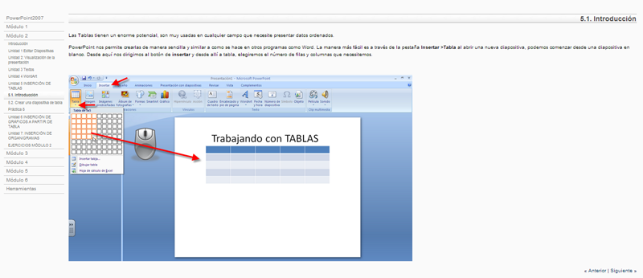
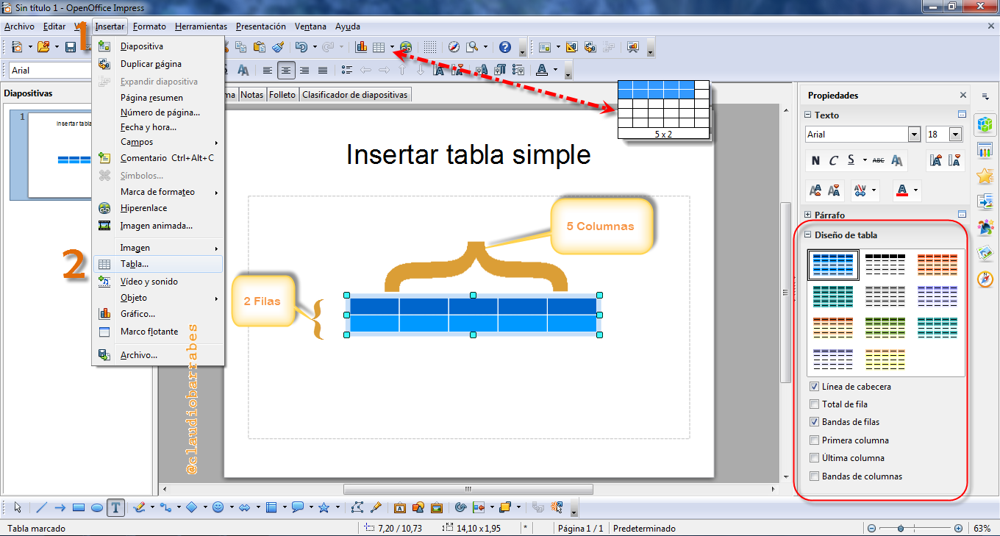
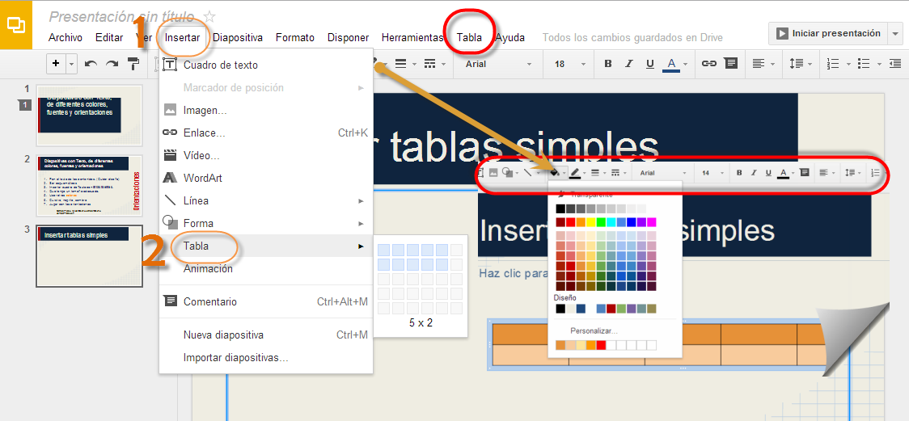
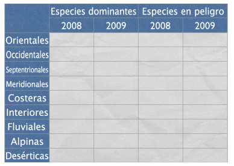

# U.1 Tablas simples

**1\. Diapositiva con  Tablas simples**

Las tablas constituyen una excelente modo de presentar datos o información para examinarlos y compararlos con facilidad. Las tablas también pueden usarse en como marco para presentar texto e imágenes.

### 1.1.   PowerPoint

Visitemos el [siguiente enlace](https://support.office.com/es-es/article/Agregar-una-tabla-a-una-diapositiva-34F106C9-5320-4B89-9129-806E64B258AC), veamos solamente lo referente a tablas:

( Fig.2.1.0: C.Barrabés, montaje pantalla captura programa,  [Algunos derechos reservados](http://creativecommons.org/licenses/by-nc-sa/2.0/deed.es "Derechos reservados. Atribución-NoComercial-CompartirIgual 2.0 Genérica (CC BY-NC-SA 2.0)"))

#### 1.2.     En OpenOffice

(Fig.2.1.1: C.Barrabés, montaje pantalla captura programa, [Algunos derechos reservados](http://creativecommons.org/licenses/by-nc-sa/2.0/deed.es "Derechos reservados. Atribución-NoComercial-CompartirIgual 2.0 Genérica (CC BY-NC-SA 2.0)"))

#### 1.3.     En Drive

Para añadir una tabla a una diapositiva de la presentación, seguir los pasos que indicamos a continuación:

*   Seleccionar una diapositiva.
*   Ir al menú Tabla y selecciona Insertar tabla.
*   Seleccionar las dimensiones de la tabla.
*   Una vez que la tabla aparezca en la diapositiva, podemos empezar a modificarla.
*   Ver el siguiente enlace: [https://support.google.com/drive/answer/1696711?hl=es&ref_topic=1694924](https://support.google.com/drive/answer/1696711?hl=es&ref_topic=1694924)

(Fig.2.1.2: C.Barrabés, montaje pantalla captura programa, [Algunos derechos reservados](http://creativecommons.org/licenses/by-nc-sa/2.0/deed.es "Derechos reservados. Atribución-NoComercial-CompartirIgual 2.0 Genérica (CC BY-NC-SA 2.0)"))

#### 1.4.     En Keynote

Cuando añadimos una nueva tabla en Keynote, por defecto aparece como una tabla de tres filas por tres columnas (3x3), con o sin filas y columnas de cabecera, en función del tema que se esté usando. Las tablas están diseñadas para corresponderse con el tema.

Es sencillo personalizar una tabla con tantas filas y columnas como deseemos, así como añadir o eliminar una columna de cabecera y filas y de pie de página antes de empezar a introducir contenido en las celdas.

**Para crear una nueva tabla en Keynote:**

1.  Clic en Tabla en la barra de herramientas o seleccionar **Insertar** \> **Tabla**.

Aparecerá una tabla de tres filas por tres columnas.

1.  Ajustar el número de filas y columnas por ejemplo 5 x 2 campos de filas y columnas de la barra de formato.
2.  Para añadir una o varias columnas de cabecera, clic en el botón de columna de cabecera de la barra de formato y seleccionar el número que desee en el menú local, hasta 5.

**(*)**Tan solo haciendo clic en el botón de columnas de cabecera se añadirá o se eliminará una sola columna de cabecera, a menos que haya añadido varias cabeceras o que haya introducido contenido en las celdas.

1.  Para añadir una o varias filas de cabecera, clic en el botón de fila de cabecera de la barra de formato y seleccionar el número que necesitemos en el menú local (cinco como máximo). **(*)**
2.   Para añadir una o varias filas de pie de página, clic en el botón de fila de pie de página de la barra de formato y seleccionar el número que deseemos en el menú local (cinco como máximo). **(*)**
3.  Para cambiar el tamaño de la tabla, arrastrar uno de sus tiradores de selección. Para mantener las proporciones de la tabla, mantener pulsada la tecla Mayúsculas mientras arrastra. Para expandir la tabla desde su centro, mantener pulsada la tecla Opción mientras arrastramos.
4.   Arrastrar la tabla para colocarla en el lugar que deseemos dentro del lienzo de diapositivas.

**Para dibujar una tabla con el número de filas y columnas que deseemos:**

 1 Con la tecla Opción pulsada, haga clic en Tabla en la barra de herramientas.

 2 Soltar la tecla Opción y arrastrar el ratón por el lienzo de diapositivas (el puntero adoptará la forma de cruz).

Mientras arrastramos, aparece una tabla y el número de filas y columnas aumenta o disminuye según el tamaño de la tabla.

 3 Cambiar la tabla de tamaño y posición, del modo en que se describía en la tarea anterior.

**Estos son algunos modos de crear una nueva tabla a partir de una tabla existente:**

 Para crear una nueva tabla basada en una o varias celdas contiguas de una tabla existente, seleccionar la celda o celdas y, a continuación, arrastrar a una ubicación vacía del lienzo de diapositivas.

Copiar una tabla en un documento de Pages o en una hoja de Numbers y pegarla en el lienzo de diapositivas.

(Fig.2.1.3: Apple, montaje pantalla captura programa, [Algunos derechos reservados](http://creativecommons.org/licenses/by-nc-sa/2.0/deed.es "Derechos reservados. Atribución-NoComercial-CompartirIgual 2.0 Genérica (CC BY-NC-SA 2.0)"))

Si una tabla contiene tanto filas como columnas de cabecera, la celda (o celdas) superior izquierda se considera parte de la fila de cabecera. Las columnas de cabecera aparecen debajo de cualquier fila de cabecera.

Para añadir filas o columnas de cabecera, primero debemos seleccionar una tabla.

