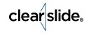

# U2. ClearSlide y Sliderocket

 [https://www.clearslide.com/](https://www.clearslide.com/ "ClaerSlide")

**¿Qué es ClearSlide?**

Se trata de una herramienta para **almacenar, optimizar, compartir y analizar presentaciones. **

 Permite crear presentaciones on line de mucha calidad, así como editarlas y compartirlas

ClearSlide Power User Event 2013

[http://youtu.be/BBL1Ee56DLM?t=3m4s](http://youtu.be/BBL1Ee56DLM?t=3m4s "Evento ClearSlide")

ClearSlide compró el servicio de presentaciones interactivas online SlideRocket.

La integración con ClearSlide afectará SlideRocket a las cuentas existentes.  Ya no se están aceptando inscripciones para SlideRocket en su forma actual.

(**SlideRocket** es un nuevo enfoque revolucionario para las comunicaciones empresariales diseñados desde el principio para ayudarnos a hacer grandes presentaciones) [http://www.sliderocket.com/product/](http://www.sliderocket.com/product/ "Productos")

Veamos un video de lo que era SlideRocket y sus semejanzas con ClearSlide en: [http://www.sliderocket.com/video/tour/index.html](http://www.sliderocket.com/video/tour/index.html "Tour")

Una mejor herramienta de presentación integrada. Esta nueva plataforma será  el sitio web ClearSlide, así que tiene sentido que todas las cuentas nuevas comienzan allí.

Por lo tanto, consultemos **ClearSlide**.   

Está más dirigido a empresas: Realizar presentaciones de alta fidelidad en cualquier momento y en cualquier lugar con las aplicaciones móviles para su iPad o teléfono móvil.

[https://www.clearslide.com/](https://www.clearslide.com/ "Web")

Ver vídeo en inglés: [https://d3nsmp4txz3cjc.cloudfront.net/videos/salesleader.mp4](https://d3nsmp4txz3cjc.cloudfront.net/videos/salesleader.mp4)

**Contenido **  

Nuestros alumnos podrán acceder fácilmente y podrán  re-mezclar presentaciones personalizadas. 

Subir variedad de tipos de archivo, incluyendo Microsoft Office, PDF, OpenOffice, Keynote, video, audio, y archivos Flash.

**Características**

Opciones de poder realizar presentaciones a tiempo real, incorporando acceso a pantalla para poder presentar contenidos.

Podemos ver sus _**estadísticas**_, con las que podemos ver no solo quién y cuándo ha estado viendo nuestra presentación, sino también que tiempo ha dedicado a visualizar el documento entero o solo una diapositiva en concreto. Esto nos puede servir para:

-Ver el interés de la audición por los contenidos presentados, dependiendo del tiempo dedicado a la propuesta.

-Analizar que partes de la presentación se pueden optimizar. Si varias personas dedican un segundo a visualizar una diapositiva es porque quizás se entienda bien y si varias personas permanecen demasiado tiempo intentando analizarla, es que es el contenido demasiado es demasiado complicada.

Presentación que analiza esta herramienta con detalle, y la comparten, a través de Clearslide.

[http://clearslide.com/view/mail?iID=6Y92LBG3VBHNHQPMNWRJ](http://clearslide.com/view/mail?iID=6Y92LBG3VBHNHQPMNWRJ "Presentación Clarslide")

