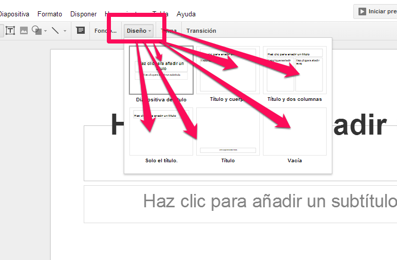

# U.2 DISEÑO

En todas nuestras diapositivas tenemos que colocar imágenes y datos, en su justa medida, nuestro cerebro está diseñado para el análisis visual combinado.

Antes de comenzar a diseñar es importante definir el objetivo a conseguir.

 Una buena presentación, debe ser clara, flexible, funcional y sencilla.

Todo un proceso diseño, debe considerar cuatro fases: análisis, diseño o planificación, desarrollo e implantación.

Las gráficas comunican exclusivamente hacia el hemisferio derecho del cerebro, no depende de lo verbal o de una interpretación exclusivamente intelectual.

Tengamos en cuenta estos aspectos, utilicemos las plantillas de diseño y cada vez nuestras presentaciones serán mejores.

