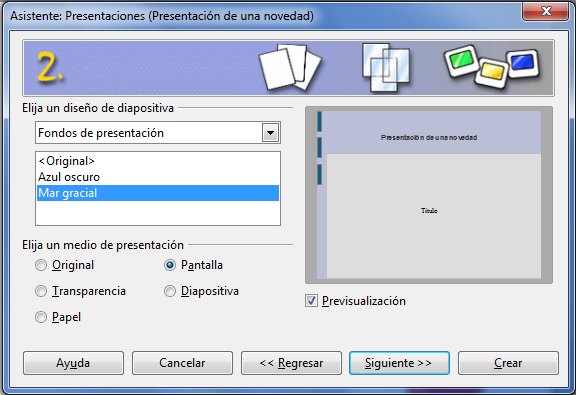
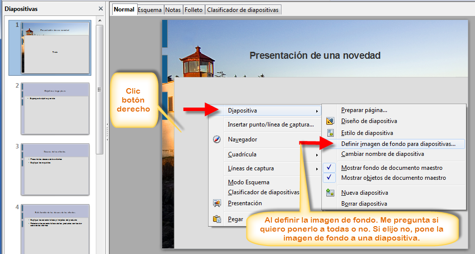
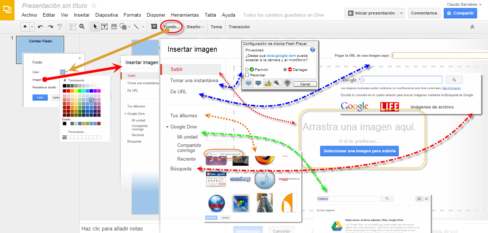

# U.2. Insertar Fondos

El fondo de una diapositiva aunque parezca un elemento secundario, juega un papel importante para el éxito de una presentación.

*    Emplea fondos diversos para presentaciones de gran cantidad de diapositivas (más de 20), pero que tengan un **nexo común**.
*   Juega con las diferentes texturas que ofrece el programa, así la textura de madera transmite un efecto cálido.
*   Si empleas varios fondos intenta que la secuencia de los mismos sea de mayor a menor monotonía.

**2.1 En PowerPoint**

Pdemos elegir los fondos de la diapositiva en este menú de **Diseño **

También podemos elegir una imagen nuestra en el diálogo que se muestra:

Ver tutorial [http://catedu.es/materialesaularagon2013/presentaciones/insertarfondospowerpoint.mp4](http://catedu.es/materialesaularagon2013/presentaciones/insertarfondospowerpoint.mp4)

**2.2. En OpenOffice**

Podemos empezar a seleccionar el fondo en el asistente:

Si no nos gusta el fondo. Clic Botón derecho sobre la diapositivas que estamos. Elegir **Diapositiva** \> pestañita negra y elegir **Definir imagen de fondo para diapositivas…**

****

Vamos jugando con estas opciones y colocamos el fondo igual que lo hacemos con otros programas.

**2.3. En Drive**

****

Vamos a **Fondo,** podemos cambiar el color simplemente, nosotros hemos elegido un azul claro, para mantener un diseño relajado y serio. Podemos también, elegir una imagen que subiremos desde nuestra máquina con **Subir**. Podemos tomar una instantánea desde nuestro webcam (dando los permisos y configurando lo bien). Desde URL como marca el gráfico en la línea azul más larga, nos abrirla una ventana que nos pide “Pega la URL de una imagen aquí” (el problema será si esa página elimina esa imagen la perderemos como fondo).

Por otro lado si tenemos Álbumes creados en nuestro Drive, podemos seleccionar de cualquiera de ellos una imagen. En nuestro caso, hemos elegido : Tus álbumes | TIC'S para la educación. Es nuestro álbum del blog personal en Blogger. También, puedo seleccionar imágenes compartidas conmigo, recientes.

Si no me convencen, puedo ir a Búsqueda (línea roja **.-.-**) se abre una ventana, que me permite buscarla en Google, Life o de archivo.

**2.4.     En Keynote**

### **Para modificar el fondo de una diapositiva maestra:**

1  Seleccionar la diapositiva maestra con la que deseamos trabajar.

2  Seleccionar los elementos no deseados y pulsar la tecla Suprimir.

3  Si deseamos que un objeto (figura, imagen, sonido o archivo de película, tabla o gráfica) sea un elemento de fondo, añadirlo a la diapositiva maestra y editar su tamaño y posición en la diapositiva.

Después de colocar un objeto, podemos seleccionar **Disposición** \> **Bloquear** para evitar moverlo sin darnos cuenta mientras trabajamos.

4  Para permitir que los objetos de la diapositiva maestra se entrelacen con los objetos añadidos a las diapositivas basadas en dicha diapositiva maestra, abrir el Inspector de las diapositivas maestras, clic en **Apariencia** y seleccione “**Permitir apilar los objetos de la diapositiva con la diapositiva maestra**”.

5  Para rellenar el fondo de la diapositiva con un color o una imagen, utilizar los controles de Fondo del panel Apariencia disponibles en el Inspector de las diapositivas maestras.

Un uso habitual de las capas de fondo es para gráficos de canal alfa (gráficos con transparencia); se pueden añadir objetos a una diapositiva y apilarlos para que se muestren a través de parte de la imagen de fondo.

### **Cómo modificar el fondo de una diapositiva**

Si lo deseamos, podemos cambiar el color o la imagen del fondo de cualquier diapositiva. Estas modificaciones se efectúan en la ventana de información de la diapositiva.

Para modificar el fondo de una diapositiva:

1\. Seleccionar la diapositiva que desea modificar.

2\. Seleccionar **Visualización** \> Mostrar Información (o haga clic en el botón de información en la barra de herramientas).

3\. En la ventana de información, haga clic en Diapositiva para abrir la información de la diapositiva.

4\. Eligir un tipo de fondo en el menú local Fondo. Si seleccionamos "Relleno de imagen", localicemos la imagen que deseamos usar como fondo en la ventana que aparecerá y haga clic en Abrir. Si seleccionamos Relleno del degradado, eligir dos colores en los cuadros de color.

Si aplicamos un relleno de imagen, en el menú local podemos elegir una manera de ajustar la imagen a la diapositiva.

Si aplicamos un degradado, podemos ajustar su ángulo mediante la rueda correspondiente.

### Cambiar el tema de la presentación

*   Clic en Archivo > “**Cambiar tema**” y seleccionar un tema nuevo.
*   Anular la selección de la casilla “**Conservar los cambios de estilo**” si deseamos que los estilos de tema nuevos anulen los cambios de estilo.
*   Clic en **Seleccionar**.

