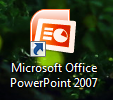
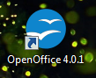
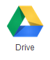
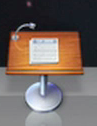
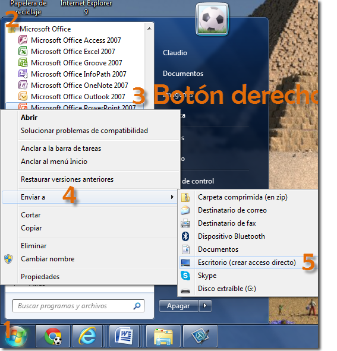
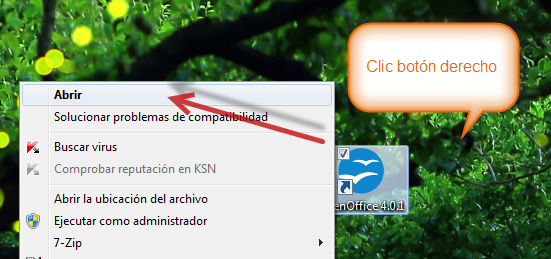

# U.2 Abrir y cerrar el programa

Veamos las formas básicas de iniciar los programas.

  Kynote

 (Imágenes 1,2,3 y 4) ( Fig.1.2.1: C.Barrabés, montaje pantalla captura programa, [Algunos derechos reservados](http://creativecommons.org/licenses/by-nc-sa/2.0/deed.es "Derechos reservados. Atribución-NoComercial-CompartirIgual 2.0 Genérica (CC BY-NC-SA 2.0)"))

**PowerPoint, Open Office**

**Entrar a los programas desde los accesos directos**

Todos los programas instalados en mi máquina, pueden abrirse desde el acceso directo con un doble clic del botón izdo., que encontraremos en pantalla (Imágenes 1,2,3 y 4) ( Fig.1.2.1.) 

Si no tienes acceso directo en el escritorio Clic en **Iniciar **--> **Todos los programas** --> **Microsoft Office** --> **Microsoft Office PowerPoint 20XX**.

Su aspecto puede ser ligeramente distinto en función de la versión de Windows que utilicemos. 

****Google Drive ****

Para entrar en Drive mira en el Módulo 0 en la Unidad 3 el apartado 3.1 "Subir archivos al Drive" allí explica cómo entrar en Drive

Puede existir en tu centro un Google Apps, si es el caso, puedes utilizar ese camino.

## Importante

Si no existe el acceso directo y queremos crearlo hacer clic con el botón derecho del ratón sobre la opción del programa, por ejemplo el Microsoft PowerPoint del menú inicio. Luego selección a **Enviar** a > **Escritorio** (crear acceso directo).

( Fig.1.2.3: C.Barrabés, montaje pantalla captura programa,  [Algunos derechos reservados](http://creativecommons.org/licenses/by-nc-sa/2.0/deed.es "Derechos reservados. Atribución-NoComercial-CompartirIgual 2.0 Genérica (CC BY-NC-SA 2.0)"))

**1.3.   También podemos abrir el programa desde el acceso directo pero con el botón derecho** --> **Abrir**

( Fig.1.2.1: C.Barrabés, montaje pantalla captura programa, [Algunos derechos reservados](http://creativecommons.org/licenses/by-nc-sa/2.0/deed.es "Derechos reservados. Atribución-NoComercial-CompartirIgual 2.0 Genérica (CC BY-NC-SA 2.0)"))

**1.4.   Abrir el programa Keynote**

Si no tenemos el programa deberemos buscarlo en el APP Store, cuenta poco menos de 20 Dólares. Lo descargamos e instalamos, nos generará el icono a través del cual podremos abrir el programa.

Los documentos KEYNOTE son Archivos varios asociados con iWork Keynote File (Apple Inc.).

La forma más rápida y sencilla de abrir su archivo KEYNOTE es haciendo doble clic sobre éste.

## Actividad

Una vez visto como abrir el programa, vamos a practicarlo en nuestra máquina.

Si no tenemos acceso directo lo creamos en nuestro escritorio, nos será muy útil para la realización del curso.

1.  Crear acceso Directo al PowerPoint

2.  Acceso directo al OpenOffice impress (si no lo tenemos instalado lo hacemos. Ver [**(Vídeo tutorial  1)**](http://aularagon.catedu.es/materialesaularagon2013/presentaciones/instalaropenOffice.mp4) de instalación de OppenOffice.

3.  Drive está en la nube. Si tenemos Gmail, ya lo podemos usar, accediendo a la cuenta, vamos al icono . Si no vamos pensando un usuario para ir creando una cuenta Ahora.[**(Vídeo tutorial 2)**](http://aularagon.catedu.es/materialesaularagon2013/presentaciones/crearcuentagmail.mp4) También cuando lo deseemos, tendremos la opción de descargarlo en nuestra máquina.

4.  Si somos de Mac, creamos el acceso directo. 

Mediante los Alias podemos acceder a cualquier archivo que tengamos un difícil acceso, es la alternativa a usar _Quicksilver_ o _Spotlight_, útil para los que se acaban de cambiar a Mac y echan de menos esta función de PC.

Para crear un Alias sólo tenemos que abrir el menú secundario del archivo, dando a la zona derecha del TrackPad en caso de usar MacBook o el botón secundario si usamos iMac con un ratón. Nos aparecerá un menú como el de la imagen inferior, aquí sólo debemos seleccionar Crear Alias.

## Pregunta Verdadero-Falso

###  Leer atentamente la pregunta y marcar si es Verdadera o Falsa

### Pregunta 1

### ¿Puedo abrir mi programa de presentacione OpenOffice Impress desde?

Desde el botón Inicio, de  la esquina inferior izquierda:  Clic en **Iniciar -->****Todos los programas** --\> OpenOffice

$exe.hint.imgs=\["panel-amusements.png","stock-stop.png"\]

#### Sugerencia

###  Desde el botón Inicio, de  la esquina inferior izquierda

 Clic en **Iniciar -->****Todos los programas** --\> OpenOffice --> OpenOffice Impress

 Verdadero  Falso

#### Retroalimentación

**Falso**

Ir un poco más Allá

### Pregunta 2

¿Puedo crear una acceso directo con el botón Izquierdo?

$exe.hint.imgs=\["panel-amusements.png","stock-stop.png"\]

#### Sugerencia

Escritorio

 Verdadero  Falso

#### Retroalimentación

**Falso**

Enviar a

