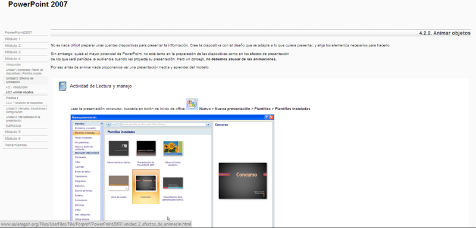
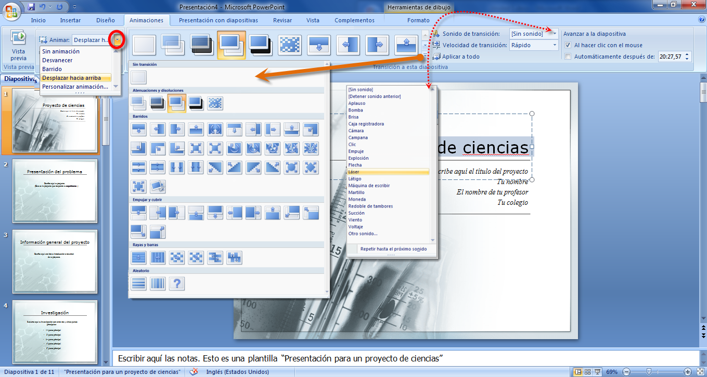
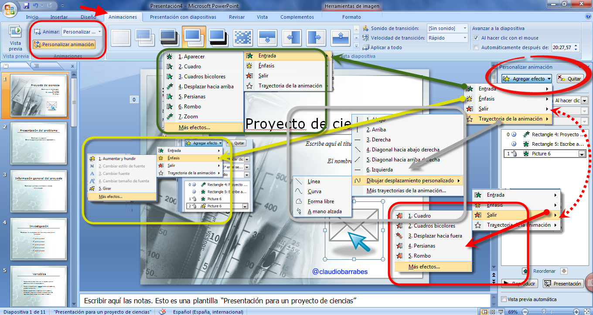
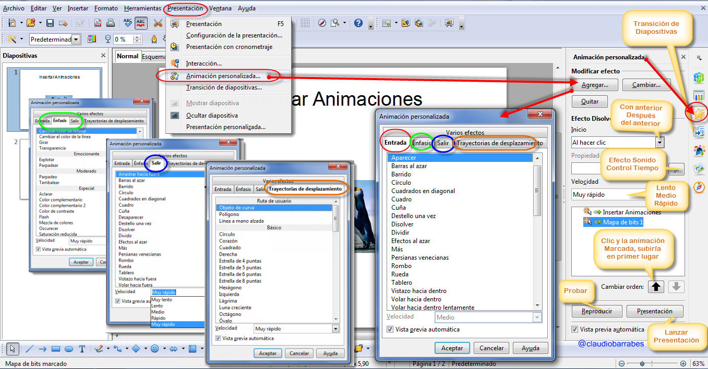
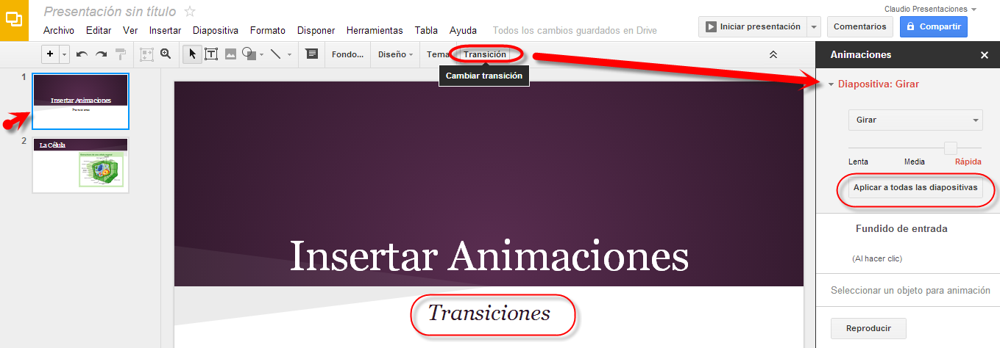
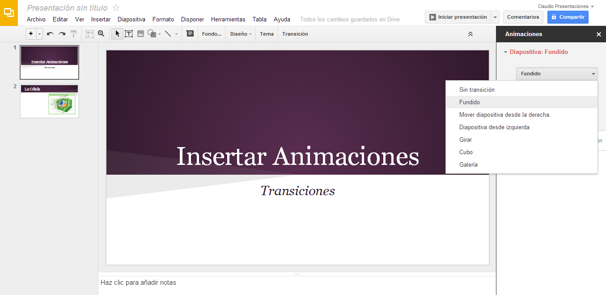
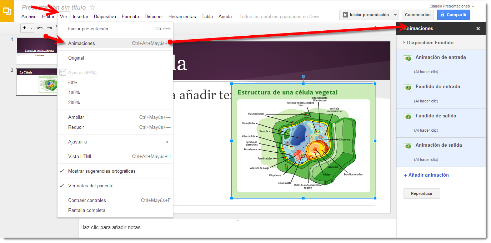

# U.2. Insertar Animaciones

## **Estilo**

Son elementos motivadores, muy útiles sobre todo en presentaciones de ejecución automática, pero **no** debemos **abusar** de ellos porque pueden ocasionar el efecto contrario al deseado.

Intenta ser coherente con los elementos de animación establecidos para cada diapositiva, manteniendo una estructura lógica a lo largo de la presentación. No hagas de cada diapositiva un conjunto de efectos incoherentes al resto.

Elige el efecto de animación en función a cómo va a trabajar con el elemento al que se le aplica la animación. Así si presenta una información para posteriormente debatirla, conviene que dicha información se atenúe después de la animación

**PowerPoint**

Repasar efectos de animación, ver enlace o mirarlo en la ventana inferior: [http://www.aularagon.org/Files/UserFiles/File/Forprof/PowerPoint2007/unidad\_2\_efectos\_de\_animacin.html](http://www.aularagon.org/Files/UserFiles/File/Forprof/PowerPoint2007/unidad_2_efectos_de_animacin.html)

Personalizar animación:

**2.2. En OpenOffice**

Nos vamos a la pestaña Presentación, desde allí podemos lanzar la presentación, como en PowerPoint podemos también iniciarla haciendo clic a la tecla (**F5**).  Podemos Configurar la **presentación,** en Iniciar la presentación (ventana emergente), podremos configurar que nos la muestre a partir de una determinada página, variar el **Tipo** de predeterminado, ventana o auto a partir de un tiempo. Podemos modificar las **Opciones** cambiando puntero ratón, ver navegador, permitir o no animaciones etc. En este apartado tenemos configuración de varios monitores, pero lo veremos más adelante.

El Tipo Auto, es interesante, para lanzar la presentación automáticamente, podremos configurar el tiempo y al terminar la misma vuelve a comenzar por defecto en 10 segundos.

**Presentación con cronometraje,** nos muestra un cronómetro cuando hacemos la presentación en la parte inferior izquierda.

**Interacción:** Nos permite marcando un objeto a la diapositiva, marcarle un destino de la presentación, puede ser una página, objeto, reproducir un sonido, ejecutar acción, programa, marco, o terminar la presentación

**Animación Personalizada.  Varios Efectos.**

Podemos modificar en un objeto de la presentación su:

**Entrada:** (Efectos _Básicos_ :Aparecer, Barras al azar, Barrido…. _Emocionante: B_umerán, créditos de película…. _Moderado_: Ascender, comprimir, zoom …  _Especial_: Desvanecer y zoom…)

**Énfasis: ( Básico:** cambiar color de relleno, de línea, girar, transparencia. Emocionante: Explotar, Parpadear.  Moderado;  Parpadeo, Tambalear. Especial: Aclarar, color complementario Flash…)

**Salir**: ( **Básico:** Arrastra hacia fuera, Barras al azar, barrido… Emocionante: Bumerán, Créditos de película, curva hacia abajo, deslizar….  Moderado: Ascender, Contraer, desaparecer hacia….. Especial: Atenuar, atenuar y zoom, Contraer.)

**Trayectorias de desplazamiento**: (Ruta de Usuario: Objeto de curva, Polígono y Línea a mano alzada **Básico:** Círculo, Corazón, cuadrado, Derecha, Estrella de 4,5,6,8 puntas, Hexágono….) Líneas y curvas:Abajo, Arco…, arriba, Curva en S1, S2… Diagonal…Embudo, Escaleras…. Especial: Alubia, Bucle, Cacahuete, cuadrado curvado…..)

**2.3  En Drive**

PRESENTACIONES

#### Cómo añadir animaciones y transiciones

Las animaciones sirven para dinamizar las diapositivas. También son una buena forma de revelar texto u objetos paso a paso en una diapositiva. Por ejemplo, podrías tener cinco elementos de texto y mostrarlos uno por uno en una diapositiva haciendo clic cada vez.

Con las transiciones, puedes hacer que pasar de una diapositiva a otra sea más interesante. Puedes añadir o modificar transiciones de diapositivas y animaciones en el panel "Animaciones". A continuación, te indicamos cómo habilitar el panel "Animaciones":

*   Acceder al menú Diapositiva y selecciona Cambiar transición.
*   Acceder al menú Ver y selecciona Animaciones.
*   Acceder al menú Insertar y selecciona Animaciones.

El panel Animaciones se divide en dos niveles. En la parte superior, verás las opciones de transición. Utiliza el menú desplegable para elegir una transición para la diapositiva que hayas seleccionado. Elige la opción que aparece debajo del menú desplegable para aplicar esta transición a todas las diapositivas de la presentación. En la parte inferior, podemos aplicar [animaciones](https://support.google.com/drive/answer/answer.py?answer=1689475) al texto y a los objetos.

#### Cómo añadir animaciones a una diapositiva

Seleccionar una diapositiva. Ir al menú **Ver** y selecciona **Animaciones**. El panel "Animaciones" aparece en el lateral derecho de la pantalla.

_Selecciona una figura_. Acceder al menú **Insertar** y selecciona **Animaciones**. El panel "Animaciones" aparece en el lateral derecho de la pantalla.

Clic con el botón derecho en una figura y selecciona **Aplicar animación**.

**15.4. En Keynote**

Las presentaciones a pantalla completa permiten obtener el máximo partido de las prestaciones gráficas y las animaciones de gran calidad que ofrece Keynote. Podemos realizar presentaciones a pantalla completa en la pantalla del ordenador, en una segunda pantalla o en un proyector externo de gran tamaño, y podemos reproducir películas y sonido durante la presentación.

[http://internet-y-ordenadores.practicopedia.lainformacion.com/programas/como-trabajar-con-transiciones-en-keynote-11985](http://internet-y-ordenadores.practicopedia.lainformacion.com/programas/como-trabajar-con-transiciones-en-keynote-11985)

[http://internet-y-ordenadores.practicopedia.lainformacion.com/programas/como-anadir-efectos-a-una-presentacion-en-keynote-11983](http://internet-y-ordenadores.practicopedia.lainformacion.com/programas/como-anadir-efectos-a-una-presentacion-en-keynote-11983)

