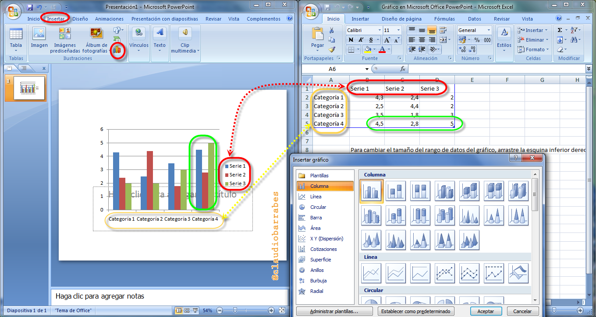
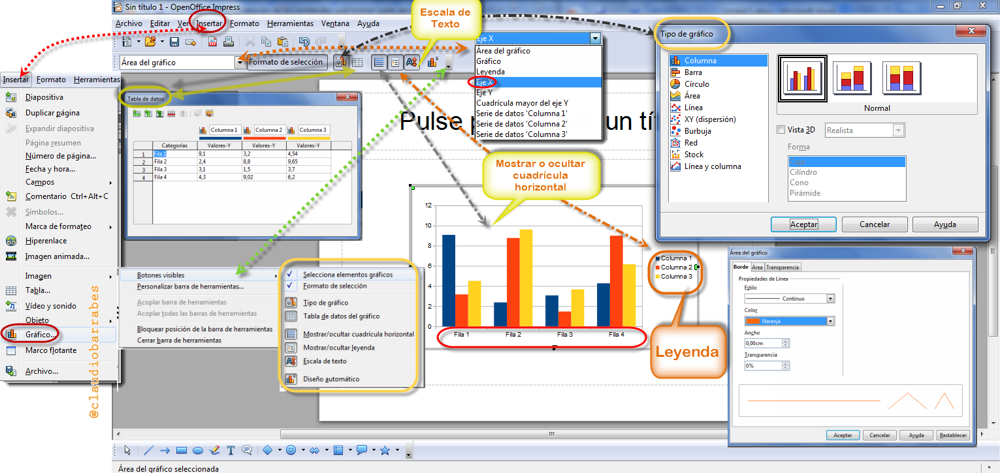
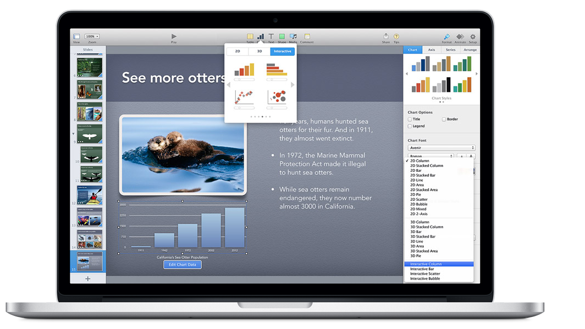
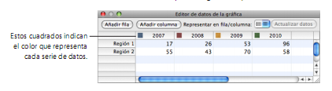
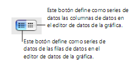

# U.2 Insertar Gráficos

**2\. Una representación de datos numéricos en gráficos de varios tipos barras**

Esta es parte de lo que deberemos hacer en nuestro proyecto o práctica obligatoria del módulo 3

**2.1   PowerPoint**

****

## Actividad de lectura

En Power Point : Leer introducción, insertar gráfico y modificar gráfico: [http://www.aularagon.org/Files/UserFiles/File/Forprof/PowerPoint2007/61_introduccin.html](http://www.aularagon.org/Files/UserFiles/File/Forprof/PowerPoint2007/61_introduccin.html)

¿Cómo asignar un nombre exclusivo a tu gráfico o cómo cambiarle el nombre?

%accordion%Solución%accordion%

**Truco:**

Cuando empecemos a crear un gráfico, tal y como se ha indicado anteriormente, clic en la pestaña **Personalizar **del cuadro de diálogo para gráficos.

Introducir un nombre **en el cuadro de texto Nombre del gráfico** en la pestaña Personalizar. El nombre aparece en la parte superior izquierda del gráfico al seleccionarlo en nuestra hoja de cálculo.

Introducir un nombre en el cuadro de texto Nombre del gráfico de la pestaña Personalizar. El nombre del gráfico se muestra como etiqueta encima de este.

Nota: no todos los tipos de gráfico tienen un título, pero todos tienen un nombre de gráfico.

%/accordion%

**2.2 En OpenOffice**

****

Si vamos conociendo un programa, nos damos cuenta que es muy similar en el resto. Aunque los botones estén colocados en diferentes posiciones o tengan un diseño diferente, la base es la misma. Ánimo y seguimos.

**2.3. En Drive**

Podemos añadir distintos gráficos en una **hoja de cálculo**, como gráficos de líneas, de barras y de mapas. También podemos guardar un gráfico como imagen e insertarla en un documento o en una presentación.

 Para crear un gráfico, seguiremos los pasos que se indican a continuación:

En la hoja de cálculo, seleccionar las celdas que contienen los datos que queremos incluir en el gráfico. También podemos seleccionar un intervalo o múltiples intervalos de datos desde el cuadro de diálogo de gráficos. Para ello, haz clic en Seleccionar intervalo... e introduce uno o más intervalos haciendo clic en Añadir otro intervalo.

en la barra del menú o selecciona **Insertar** > **Gráfico**. A continuación, se abre el cuadro de diálogo para gráficos.

En la pestaña Empezar, puedes modificar el intervalo de celdas que se incluirá en el gráfico. Selecciona una configuración de diseño básica y observa los gráficos recomendados.

 Ver enlace: [https://support.google.com/drive/answer/63728?hl=es](https://support.google.com/drive/answer/63728?hl=es "Insertar un gráfico en Drive")

**2.4. En Keynote**

****

Cuando se trata de datos que expliquen, un gráfico vale más que mil palabras. Elija entre columnas, barras, circulares, de dispersión, gráficos de burbujas, y mucho más. Use la animación para añadir impacto visual. Y hacer que los gráficos interactivos centrar la atención en las etapas importantes de la historia. El efecto es enorme, pero el esfuerzo no lo es.

(Fig.3.2.5: Apple, montaje pantalla captura web, [http://help.apple.com](http://help.apple.com/))

Crear gráficas 2D y 3D a partir de sus propios datos, incluidas gráficas de sectores, barras, columnas, áreas, líneas y gráficas de dispersión, y personalicémoslascon una serie de estilos, colores y texturas. Mostremos las marcas, unidades y otras etiquetas del modo en que deseemos. Combinar dos gráficas en una sola figura.

Keynote proporciona herramientas para crear gráficas visualmente atractivas para presentar sus datos. Es posible copiar y pegar datos desde una hoja de cálculo o introducirlos directamente en el editor de datos de la gráfica para crear y editar sus propias gráficas en el mismo lienzo de diapositivas. Por omisión, el aspecto de las gráficas depende del tema que se utilice, aunque se pueden ajustar los colores, las texturas, las sombras y las etiquetas, entre otros elementos, para darle la apariencia que se desee o para resaltar elementos concretos.

### Cómo añadir una nueva gráfica e introducir datos:

Cuando creamos una gráfica, esta aparecerá en el lienzo de diapositivas junto con marcadores de posición de datos en el editor de datos de la gráfica. Cuando reemplacemos los datos del marcador de posición, la gráfica se actualizará inmediatamente para reflejar los datos que ha introducido.

**Para crear una nueva gráfica a partir de sus datos:**

  1  Colocar una gráfica en el lienzo de diapositivas realizando cualquiera de las siguientes operaciones:

*   Clic en Gráficas en la barra de herramientas y seleccione un tipo de gráfica en el menú local.
*   Dibujar una gráfica en el lienzo de diapositivas haciendo clic en Gráficas, en la barra de herramientas, con la tecla Opción pulsada y seleccionando una gráfica. Soltar la tecla Opción y desplazar el puntero sobre el lienzo hasta que adopte la forma de una cruz. Arrastrar el puntero por el lienzo para crear una gráfica del tamaño que deseemos. Para mantener las proporciones de la gráfica, mantenga pulsada la tecla Mayúsculas mientras arrastra.
*   Seleccionar **Insertar** \> **Gráfica** \> \[ tipo de gráfica\].

Aparecerá una gráfica en el lienzo, que puede arrastrar para moverla y redimensionarla, y se abrirá el editor de datos de la gráfica, que mostrará marcadores de posición de datos. El editor de datos de la gráfica es una ventana que contiene una tabla editable.

Esta tabla no aparecerá en la diapositiva durante la presentación, sino que sirve para introducir datos para la gráfica que ha creado.

(Fig.3.2.6: Apple, montaje pantalla captura web, [http://help.apple.com](http://help.apple.com/)) 

Manual Mac

Estos cuadrados indican el color que representa cada serie de datos.

  2  Para **_introducir sus datos_** en el editor de datos de la gráfica, realicemos una de las siguientes operaciones:

*   Para _editar_ las etiquetas de filas y columnas, doble clic en una etiqueta y escribir.
*   Para _añadir_ o editar el número de una celda, doble clic en él y escribir.
*   Para _reorganizar_ las filas o las columnas, arrastrar la etiqueta de una fila o columna hasta la nueva posición.
*   Para **_añadir filas o columnas_**, clic en “**Añadir fila**” o en “**Añadir columna**” para situar una fila encima de la fila seleccionada o una columna a la izquierda de la columna seleccionada. En caso de que no se seleccione ninguna fila o columna, la fila o columna que se añada aparecerá en la parte inferior o en el borde derecho de la tabla. (Para ver la nueva fila o columna, tendremos que pulsar la tecla Retorno o la tecla Tabulador, expandir la ventana del editor de datos de la gráfica o desplazarnos manualmente por el documento.)

También podemos seleccionar una celda vacía, escribir los datos correspondientes y pulsar Retorno. Se creará, de forma automática, la fila o columna adicional.

*   Para _**eliminar**_ filas o columnas, seleccionar la etiqueta de la fila o la columna en cuestión y, a continuación, pulsar Suprimir.
*   Para _**copiar**_ datos de Excel, Apple Works u otras aplicaciones de hoja de cálculo, copiar y pegar en el editor de datos de la gráfica.

  3  Para definir si las series de datos de la gráfica se representarán en las filas o columnas, clic en el botón “**Serie en fila/ columna**” del editor de datos de la gráfica.

(Fig.3.2.7: Apple, montaje pantalla captura programa, [http://help.apple.com](http://help.apple.com/))  

Visitar la página siguiente:

[http://help.apple.com/keynote/mac/6.0/#/tan1a8924264](http://help.apple.com/keynote/mac/6.0/#/tan1a8924264)

