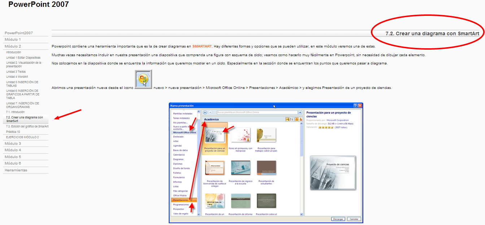
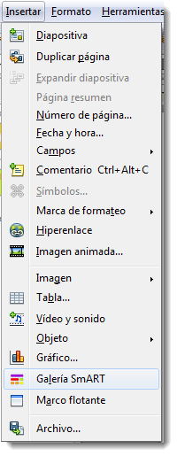
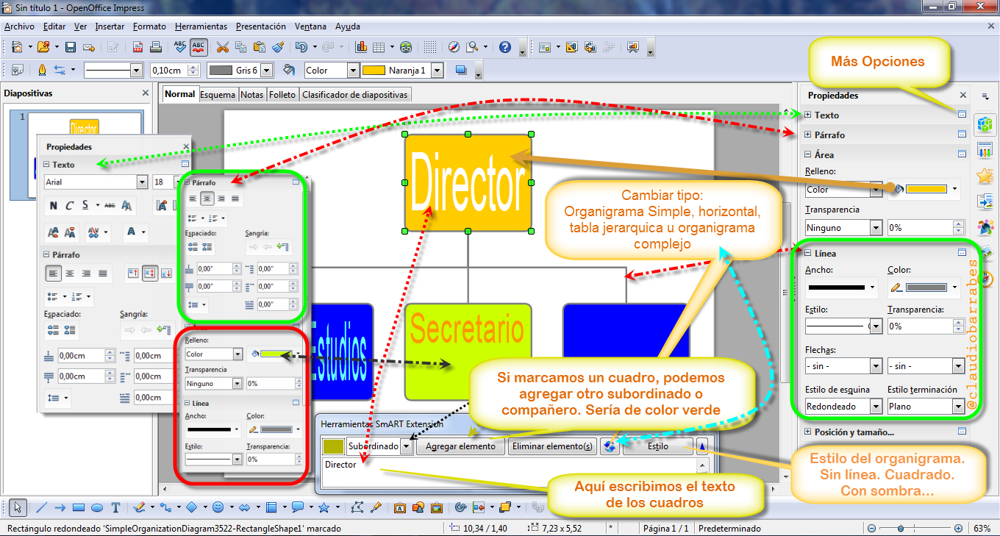

# U.3 Insertar Organigramas

**3.1.   PowerPoint**

Podemos repasar esto, en la versión 2007 en:

[Apuntes **Aularagón**](http://aularagon.catedu.es/materialesaularagon2013/presentaciones/PowerPoint2007/72_crear_una_diagrama_con_smartart.html)

Versión **2003**: [http://office.microsoft.com/es-es/powerpoint-help/agregar-un-organigrama-HP005194685.aspx](http://office.microsoft.com/es-es/powerpoint-help/agregar-un-organigrama-HP005194685.aspx)

Versión **2007**: [http://office.microsoft.com/es-es/powerpoint-help/crear-un-organigrama-HA010075853.aspx](http://office.microsoft.com/es-es/powerpoint-help/crear-un-organigrama-HA010075853.aspx)

Versión **2010**: [http://office.microsoft.com/es-es/powerpoint-help/crear-un-organigrama-HA010354860.aspx](http://office.microsoft.com/es-es/powerpoint-help/crear-un-organigrama-HA010354860.aspx)

**3.2. En OpenOffice**

Creación de un organigrama en OpenOffice

1.  Crear un organigrama en Open Office.

Abrir el programa "**Inicio**", clic en "**Todos los programas**", buscar la carpeta llamada "OpenOffice.org" y eligir "OpenOffice.org  **Writer**". Cuando el programa se abra, localizar la barra de herramientas en la parte superior de la pantalla. Clic en "**Mostrar función de dibujo**" en la barra. Aparecerá un menú de figuras y otros elementos de dibujo en la parte inferior de la pantalla.

1.  Eligir las figuras para crear un organigrama. Las figuras disponibles incluyen un rectángulo, una elipse, líneas de formas libres, figuras básicas, símbolos, flechas de bloque, diagramas de flujo y estrellas. Eligir una figura y clic sobre ella en la parte inferior de la pantalla.
2.  Clic en el documento y mantener presionado el botón izquierdo del ratón mientras arrastramos la figura en el tamaño que la necesitemos, luego soltar el botón. Clic dentro de ella y hacerla más grande, más pequeña, más corta o alta seleccionando su orilla y cambiando su tamaño. Incluir texto en las figuras haciendo doble clic dentro de ellas y tecleando.
3.  Clic en la figura de línea en la parte inferior de la pantalla para activarla. Mover el ratón a la posición donde deseemos que la línea conecte con una figura. Mientras estemos encima del punto en el que queramos conectar, presionar el botón izquierdo de tu ratón y arrastrar la línea para hacerla más larga o corta dependiendo de cómo queramos que aparezca. Soltar el botón del ratón una vez que esté en la ubicación adecuada. Repetir el proceso de agregar una figura y una línea hasta que hayamos terminado de dibujar nuestro organigrama.

Crear diagramas y organigramas en OpenOffice/LibreOffice Impress y Draw puede ser muy sencillo **instalando esta extensión.**

**Instalar SmArt**

**SmART**ha sido desarrollada por el equipo de OxygenOffice, y ha sido traducida por completo al español por el equipo de open-office.es.

Podemos bajarnos la extensión traducida al español desde este enlace: **[SmART Extension en Español](http://aoo-extensions.sourceforge.net/en/project/SmART_Extension_es "Extensión SmART en español para OpenOffice y LibreOffice")**

*    [http://aoo-extensions.sourceforge.net/en/project/SmART\_Extension\_es](http://aoo-extensions.sourceforge.net/en/project/SmART_Extension_es)
*   [http://sourceforge.net/projects/aoo-extensions/files/5305/0/smart_0.9.4.oxt/download](http://sourceforge.net/projects/aoo-extensions/files/5305/0/smart_0.9.4.oxt/download)

Una vez instalado en complemento de SmArt, ya podemos insertar el gráfico. Probar hacer algo sencillo.

Tan sólo tendremos que hacer clic en la barra de herramientas **SmART**y utilizar el selector de organigramas para insertar el tipo deseado. Disponemos de organigramas simples, tablas jerárquicas, organigramas complejos, diagramas de ciclo, piramidales, circulares, etc. En total, 8 tipos diferentes que podremos modificar y personalizar según nuestras necesidades con muy pocos clics.

Disponemos de un sencillo manual de esta herramienta en [**Manual de SmART Extension en español**](http://wiki.open-office.es/index.php?title=SmART_Extension_Crear_diagramas_y_organigramas_en_OpenOffice_y_LibreOffice "Manual Extensión SmART en español").

Si hemos instalado correctamente la Extensión SmArt, debemos apreciar un nuevo icono en OpenOffice Impress.

Si os sale el icono siguiente **felicidades Actividad realizada con éxito**.

**3.3.     En Drive**

El organigrama es una representación de un árbol de datos donde los objetos se organizan en una estructura jerárquica de principal y secundario.

Formato de los datos

En la primera columna, introducir el nombre de un objeto en la jerarquía.

En la segunda columna, introducir el nombre del objeto principal. Cada nombre principal debe aparecer también en la primera columna.

La tercera columna es el valor numérico del objeto y permite controlar el tamaño del cuadro. Este valor debe ser positivo. Esta columna debe estar vacía para entidades con entidades secundarias, puesto que el valor de una entidad principal se calcula sumando los valores de la entidad secundaria.

La cuarta columna opcional es un valor numérico que permite controlar el color del cuadro. Los valores de la cuarta columna no se suman y pueden ser negativos.

Ver:

[https://support.google.com/drive/answer/1409806?hl=es](https://support.google.com/drive/answer/1409806?hl=es)

**3.4. En Keynote**

Si seleccionamos 2 dibujos o figuras, se nos activa la opción de líneas de conexión en el **Menú** >\> **Insertar**, y nos saldrá una línea de conexión entre ambas.  
  
2 puntos azules, que son los anclajes y uno blanco, que sería para modificar la trayectoria de la línea.

Con las azules podemos pulsar click + cmd y click + alt, y vean los efectos.

Ver web: 

https://youtu.be/4nsZdOSkyO4

