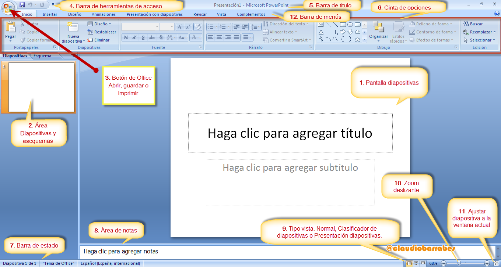
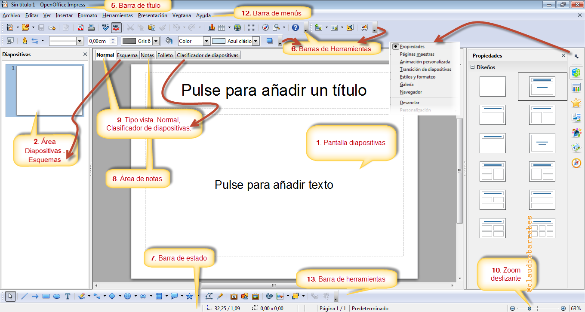
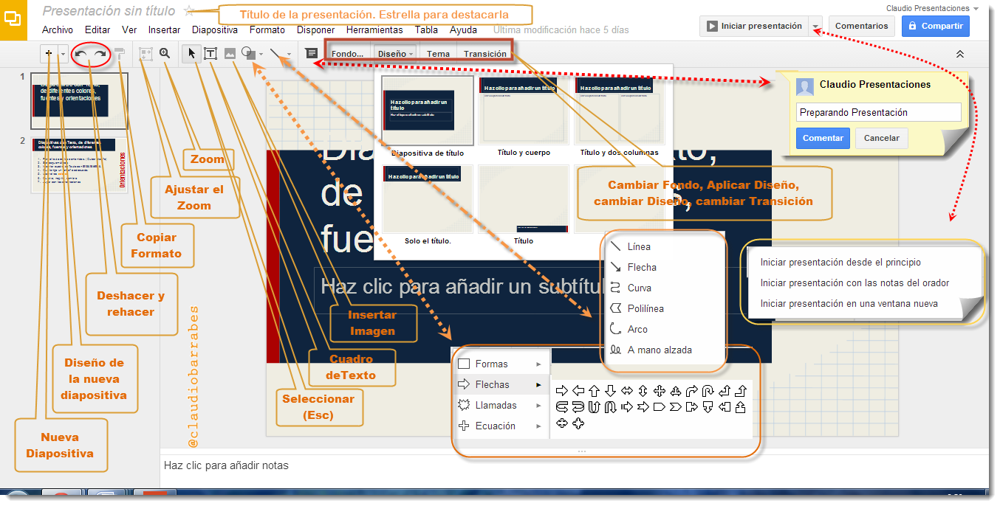
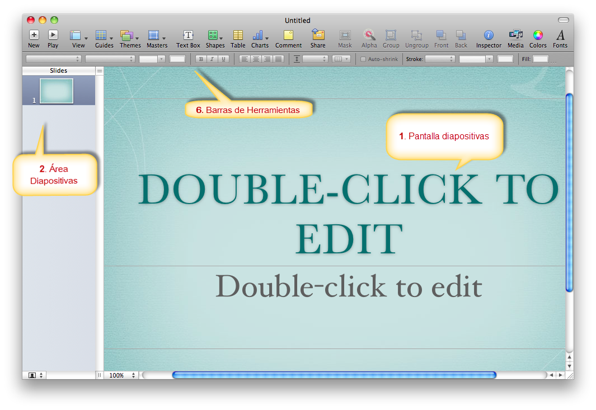

# U.3 La interfaz del programa

### 3.1.  Escritorio en PowerPoint

Veamos la versión 2007, que es la que tenemos instalada en los centros por los proyectos Ramón y Cajal, pizarra digital...

**Descripción**:

*   **Botón de office**: Es la típica mariposa que sale en todos los programas de Office 2007, en este botón tenemos acceso a los típicos botones de Nuevo, Guardar, Imprimir....
*   **Barra de herramientas de acceso rápido**: Esta barra es configurable, es decir que con el botón derecho puedes quitar o añadir los botones que quieras. Es recomendable tener al menos los dos primeros que pone por defecto "guardar" "deshacer".
*   **Barra de menús**: Por estos menús la barra estandard va cambiando.Configurable.

*   **Barra estandard**: Son las distintas opciones que tiene los botones del menú.Configurable.Hay que destacar que cuando se encuentra con el símbolo  salen más botones.

*   **Área de trabajo o diapositiva actual:** Donde se insertan los diferentes elementos de la diapositiva.
*   **Área de diapositivas**: Muestra todas las diapositivas creadas por el momento. Se puede ver en vista de **Miniaturas **o en vista de **Esquema**.
*   **Notas al orador**: Son notas personales que no salen en la proyección.
*   **Barra de estado**: Como su nombre indica muestra información relativa a la situación del programa.
*   **Barra de vista** Para pasar a vista de proyección, de clasificador de diapositivas o normal
*   **Barra de zoom** Para ampliar o reducir la vista

También podemos repasar esto en el siguiente enlace. [(Barras de trabajo)](http://www.aularagon.org/Files/UserFiles/File/Forprof/PowerPoint2007/41_las_diferentes_barras_de_trabajo.html)

### 3.2.  Escritorio OpenOffice

Fijémonos en la semejanzas y diferencias, entre la Fig.1.3.1 y Fig.1.3.2

  

### 3.3.  Escritorio en Drive

Para acceder a drive, debemos hacerlo por nuestra cuenta Gmail. Una vez allí veremos una pantalla como la figura Fig.1.3.3

### 3.4.  Escritorio en Keynote:

[http://www.apple.com/mx/findouthow/iwork/#keynote-intro](http://www.apple.com/mx/findouthow/iwork/#keynote-intro)

## Reflexión Sobre los Programa

¿Verdad que hay muchas semejanzas entre los diferentes programas?

¿Qué es lo que más os ha llamado la atención?

¿Pensáis hay que programas mejor que otros o son diferentes y se complementan?

var feedback17_9text = "Mostrar retroalimentación";

%accordion%Solución%accordion%

Aunque, nos decantemos por uno más que otros, no dejemos de probar varios, ya que esto nos va a enriquecer, seremos más hábiles y nos será más fácil cumplir con la tarea que deberemos mandar al tutor.

La pantalla de diapositivas y el área de las diapositivas está situada en la misma situación en los 4 programas.

Quizás varían las herramientas, pero podemos aplicar ciertas cosas de manera muy parecida, cambiar el tamaño de los textos, el color, insertar un cuadro de texto.

Ánimo pues, ya que poco a poco vamos a ir cogiendo soltura con las presentaciones y no sólo dominaremos algunos de estos 4 programas, en otros módulos conoceremos otras soluciones como Prezi, Slideshare ...

Veamos ahora las herramientas.

%/accordion%

