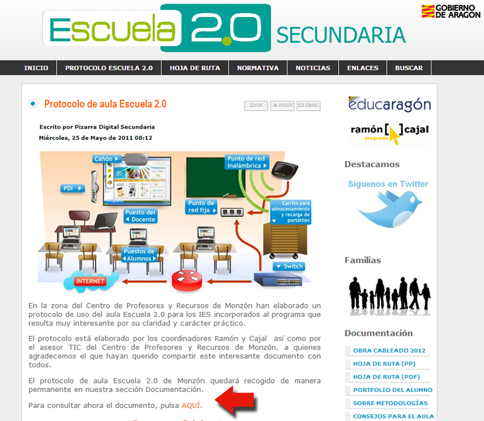
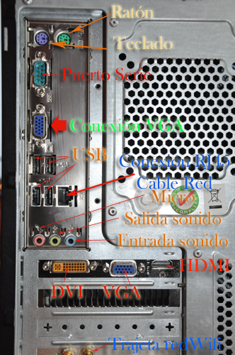
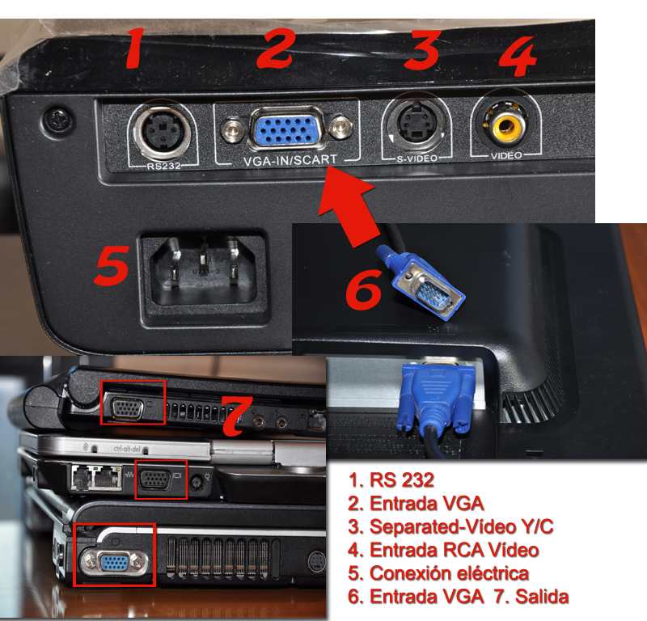

# U.3. Un poco de hardware.

**Protocolo de Aula**

Ya hemos preparado nuestra presentación.

**Imprimimos el Guión** que nos servirá para seguir la presentación. Podemos anotar el orden que vamos a llevar, las anécdotas que vamos a contar, aspectos que no queramos olvidar, también se lo podremos pasar a la audiencia como ya contamos. 

Pero tener cuidado algo puede fallar y debemos tener un **plan B**.

Tenemos la presentación den dos USBS, pendrives, colgada en la nube, en mi portátil etc.

Ahora nos falta conocer las características de las aulas y la conectividad, le podemos preguntar a nuestro coordinador TIC del centro, pero es mejor ser autónomos, por si no está o tiene clase en ese momento.

Veamos un protocolo que preparé con mis coordinadores TIC, cuando fui asesor del CPR De Monzón. Para consultar ahora el documento, pulsa [AQUÍ](http://www.catedu.es/Escuela20_Secundaria/images/documentos/protocolo_3x.pdf).

Con esto tenemos toda la información para saber las conexiones de los PC de aula.

Podemos decirte como truco que si en una PDI, está el cable mal conectado o dependiendo del modelo tiene polvo en los reflectantes, es posible que no funcione, pero siempre podemos proyectar sobre la misma.

Investigar la página inferior, tenéis información que os puede servir. (Por ejemplo podemos descargar el software de la PDI, para instalarla en nuestro portátil y preparar actividades para clase con el mismo programa si tenemos la PDI pizarra digital interactiva Hitachi. [(http://www.charmexdocs.com/int/sf.html)]((http://www.charmexdocs.com/int/sf.html))

 (Fig.4.3.1: C.Barrabés, montaje pantalla captura programa,  [Algunos derechos reservados](http://creativecommons.org/licenses/by-nc-sa/2.0/deed.es "Derechos reservados. Atribución-NoComercial-CompartirIgual 2.0 Genérica (CC BY-NC-SA 2.0)"))

Para consultar ahora el documento, pulsa [AQUÍ](http://www.catedu.es/Escuela20_Secundaria/images/documentos/protocolo_3x.pdf).

**Conexiones Pc Sobremesa:**

****

(Fig.4.3.2: C.Barrabés, montaje pantalla captura programa,**  [Algunos derechos reservados](http://creativecommons.org/licenses/by-nc-sa/2.0/deed.es "Derechos reservados. Atribución-NoComercial-CompartirIgual 2.0 Genérica (CC BY-NC-SA 2.0)"))**

**El Vídeo proyector**

Lo normal es conectarlo a un portátil aunque en el caso de tenerlo instalado fijo,puede interesar conectarle un ordenador de sobremesa.

Las **salidas de vídeo** de ordenador portátil pueden ser varias.

Los 3 tipos de salida de vídeo que más se utilizan con proyectores son:

**VGA**: Vídeo Graphics Array. Los vídeos en VGA ofrecen la resolución más baja de estos tres tipos.

**S-Video:** Separated Vídeo.  S-Video ofrece una mayor resolución que VGA pero suele hacer que la pantalla parpadee, especialmente cuando se conecta un ordenador portátil al suministro eléctrico mientras se realiza una presentación en vez de utilizar la batería

**HDMI**: High Definition Multimedia Interface. Mayor calidad de imagen que los dos anteriores y es capaz de soportar la transferencia de audio y de datos.

La entrada S-Video puede encontrarse en prácticamente todos los televisores LCD o de plasma, con lo que si vamos a realizar la presentación conectado a un televisor en vez de a un proyector, esta opción también resulta viable y adecuada.

Deberemos asegurarnos de que el ordenador portátil tiene la salida de vídeo adecuada y correspondiente a la entrada del proyector que vayamos a utilizar.

La conexión habitual (aunque no la única) es con el cable **VGA**. Una vez conexionado y preferiblemente atornillado en ambos extremos,debemos hacer dos cosas:

1.  En el vídeo proyector, deberemos seleccionar como entrada de señal de vídeo, la correspondiente e VGA, que en cada proyector se hace de diferente manera.
2.  En el **portátil** lo habitual es que dispongamos de **tres modo de “visionado”**:
    1.  Sólo se ve la pantalla del portátil;
    2.  Se ve sólo la imagen del proyector
    3.  Se ven ambas imágenes.

El cambio de los modos se produce de forma secuencial:

Para cambiar de modo,habitualmente, debemos pulsar una combinación de teclas que suele se la tecla **Fn** más una de la teclas de función (por ejemplo: **Fn+F5** En los TOSHIBA, **Fn+F4  **en los HP, **Fn+F7** Dell, sony, Lenovo.. portátiles con Windows, normalmente esto se hace presionando la tecla de "Función" (o "Fn") junto con una de las teclas "F" numeradas de la línea superior del teclado. En mucho casos ésta tendrá un dibujo de lo que parece ser un monitor de televisión en la tecla "F" que corresponde a la acción.

Conectar un ordenador **portátil Macintosh** a un proyector puede ser un poco más complicado. Necesitaremos un **adaptador especia**l **DVI-VGA **para conectarlo a un proyector que utilice VGA, así como un cable estándar de VGA. Conectamos el adaptador al puerto **DVI** del ordenador portátil y luego conecta **el cable VGA** al proyector y al adaptador. Ponemos en marcha el proyector y pulsamos continuamente **la tecla "F7" del ordenador Mac.**

Si quisiésemos conectar el proyector **a un PC de sobremesa**, deberemos proceder de forma análoga, pero como habitualmente en los PC de sobremesa, la tarjeta gráfica dispone de un único conector VGA, que lógicamente está ocupado por la conexión al monitor, deberemos desconectar el monitor del PC, conectar el proyector a la salida VGA del PC y finalmente, conectar el monitor del PC al proyector de vídeo en una salida que suelen disponer los proyectores de vídeo que no es sino un “ladrón” de señal.

Ver imágenes en:

[http://claudiobarrabes.blogspot.com.es/2013/11/conectar-un-videopoyector-un-ordenador.html](http://claudiobarrabes.blogspot.com.es/2013/11/conectar-un-videopoyector-un-ordenador.html)

 

(Fig.4.3.3: C.Barrabés, montaje pantalla captura programa,**  [Algunos derechos reservados](http://creativecommons.org/licenses/by-nc-sa/2.0/deed.es "Derechos reservados. Atribución-NoComercial-CompartirIgual 2.0 Genérica (CC BY-NC-SA 2.0)"))**

En el gráfico 4.3.3 tenemos en el nº 7 tres salidas VGA de un portátil, un tablet pc Hp y un Mini. Deberán ir conectados con el cable azul de la imagen nº 6 (que es el mismo que va de la torre al monitor) a la entrada VGA del Vídeo Proyector nº 2.

## Duplicar Pantallas

1.  **Windows 7** leer [Cómo** duplicar o extender pantallas**](http://support.microsoft.com/kb/2469705/es?WT.mc_id=KB_TEXTO_ESES#1) en la web de soporte de Microsoft.
2.  En Windows XP [ver aquí](http://support.microsoft.com/kb/307873/es)

