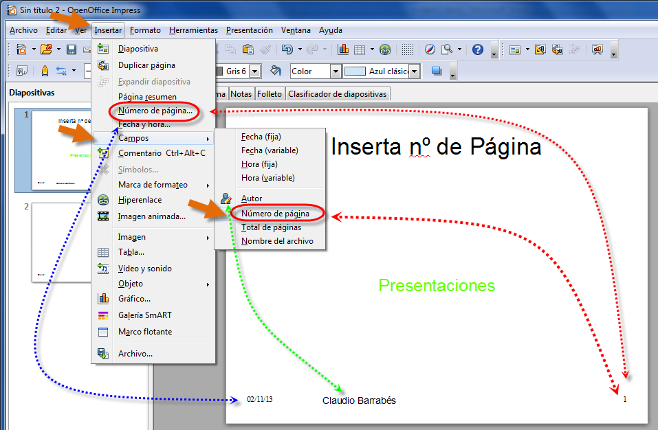
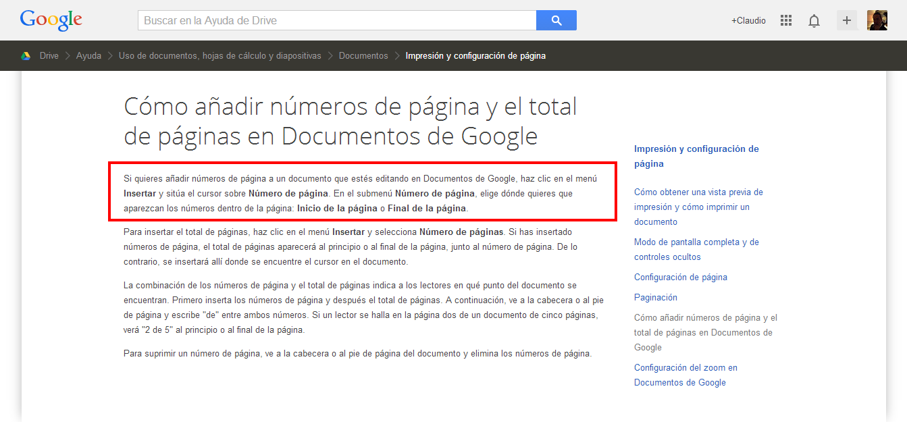

# U4 Número y pie de página

**3.1.     PowerPoint**

**1** Vamos a la pestaña **Insertar** >  **2** **Número de diapositiva**

Se nos abre un cuadro de diálogo **3** de Encabezado y pie de página. Cómo hemos elegido el tema panorámico el nº nos aparece en la parte superior izda. círculo rojo.

También podemos ver cómo quedará en la **vista previa**. Y el pie de página también (flecha verde).  Esto nos cambiará según el diseño elegido.

También podemos poner una fecha y hora (que se actualice automáticamente o fija)

(Fig.3.3.3.1.1: C.Barrabés, montaje pantalla captura programa, [Algunos derechos reservados](http://creativecommons.org/licenses/by-nc-sa/2.0/deed.es "Derechos reservados. Atribución-NoComercial-CompartirIgual 2.0 Genérica (CC BY-NC-SA 2.0)"))

Si no queremos que aparezcan estos datos en la primera diapositiva de título, marcamos la última opción rodeada de amarillo del gráfico superior.

**3.2.     En OpenOffice**

****

(Fig.3.3.3.2.3: C.Barrabés, montaje pantalla captura programa, [Algunos derechos reservados](http://creativecommons.org/licenses/by-nc-sa/2.0/deed.es "Derechos reservados. Atribución-NoComercial-CompartirIgual 2.0 Genérica (CC BY-NC-SA 2.0)"))

**3.3.     En Drive**

Veamos el enlace:

[https://support.google.com/drive/answer/83321?hl=es](https://support.google.com/drive/answer/83321?hl=es)

Lo más rápido sería insertar un cuadro de texto y colocarlo donde queramos

[(Fig.3.3.3.3.1: C.Barrabés, montaje pantalla captura programa, ](https://support.google.com/drive/answer/83321?hl=es "Ayuda Drive")[Algunos derechos reservados](http://creativecommons.org/licenses/by-nc-sa/2.0/deed.es "Derechos reservados. Atribución-NoComercial-CompartirIgual 2.0 Genérica (CC BY-NC-SA 2.0)")[)](https://support.google.com/drive/answer/83321?hl=es "Ayuda Drive")

**3.4.     En Keynote**

### **Cómo añadir números de diapositiva**

Podemos añadir números de diapositiva (similares a los números de página) a diapositivas individuales, o activar la numeración de una diapositiva maestra para que cada diapositiva nueva que se base en dicha diapositiva maestra reciba un número de diapositiva automáticamente. También podemos mostrar y ocultar los números de diapositiva de todas las diapositivas a la vez.

#### Cómo añadir números de diapositiva:

*   Seleccionar una diapositiva en el navegador de diapositivas, abrir el inspector de las diapositivas, haga clic en **Apariencia** y, a continuación, seleccionar **“Número de diapositiva”**. El número asignado refleja la ubicación de la diapositiva en el navegador de diapositivas (las diapositivas omitidas no se numeran).
*   Para añadir números de diapositiva _a una diapositiva maestra_, clic en Visualización en la barra de herramientas y seleccione **“Mostrar diapositivas maestras”.** En el navegador de diapositivas maestras, seleccionar la diapositiva maestra que deseemos modificar. Abrir el inspector de las diapositivas, clic en **Apariencia** y, a continuación, seleccionar **“Número de diapositiva”.**
*   Seleccionar Diapositiva > **“Mostrar número en todas las diapositivas”** para mostrar todos    los números de diapositiva, u **“Ocultar número en todas las diapositivas”** para ocultar

#### Para ocultar o mostrar los números de todas las diapositivas:

Los números de diapositiva.

Después de haber añadido los números de diapositiva, arrastrar el número a la posición que deseemos en la diapositiva y utilizar el panel “Tipo de letra” para dar formato al número.

En Iwork se hace así

[http://www.apple.com/mx/findouthow/iwork/#pages09-insertingnumbers](http://www.apple.com/mx/findouthow/iwork/#pages09-insertingnumbers)

