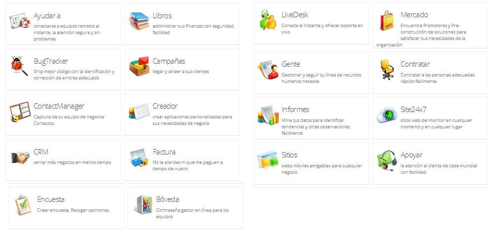

# U4. ZOHO

 [http://www.zoho.com/](http://www.zoho.com/)

**¿Qué es Zoho?**

Zoho Docs es una nueva suite ofimática en la nube que cuenta con Procesador de texto, hoja de cálculo y presentaciones bastante completas.

La gratuita tiene un espacio de 1 GB.

"**Zoho** es el nombre de un conjunto de [aplicaciones web](http://es.wikipedia.org/wiki/Aplicaci%C3%B3n_Web "Aplicación Web") desarrolladas por la empresa de la India [Zoho Corporation Private Limited](http://es.wikipedia.org/w/index.php?title=Zoho_Corporation_Private_Limited&action=edit&redlink=1 "Zoho Corporation Private Limited (aún no redactado)") antes AdventNet. Para poder utilizar dichas herramientas es obligatorio registrarse y la gran mayoría cuentan con una versión gratuita, aunque algunas de las herramientas se encuentran todavía en fase [beta](http://es.wikipedia.org/wiki/Beta "Beta")." Colaboradores de Wikipedia, "Zoho," _Wikipedia, La enciclopedia libre,_ [http://es.wikipedia.org/w/index.php?title=Zoho&oldid=70799283](http://es.wikipedia.org/w/index.php?title=Zoho&oldid=70799283) (descargado 22 de noviembre de 2013).

Más de 8 millones de usuarios trabajan en línea con Zoho

Encarado al mundo de los negocios.

*   **Zoho Encuestas**

Podemos hacer encuestas.

*   ****Zoho CRM ****

**CRM **"Customer Relationship Management". Estrategia de negocio basada principalmente en la satisfacción de los clientes. Existen sistemas que permiten implementar esa estrategia. DANA es un sistema que permite aplicar dicha estrategia. Según:[http://www.danaconnect.com/wiki/index.php/Glosario\_de\_términos](http://www.danaconnect.com/wiki/index.php/Glosario_de_t%C3%A9rminos)

Affordable Software CRM On-demand

Ver videos: [http://www.youtube.com/watch?feature=player_embedded&v=8pVN5bAUYwU](http://www.youtube.com/watch?feature=player_embedded&v=8pVN5bAUYwU)

PowerPoint [http://youtu.be/aF5152yYROk](http://youtu.be/aF5152yYROk)

Presentaciones: [http://youtu.be/ZjnjpxU9xn8?t=7m56s](http://youtu.be/ZjnjpxU9xn8?t=7m56s)

 

 Fig. 6.4.1

