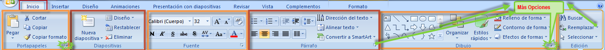
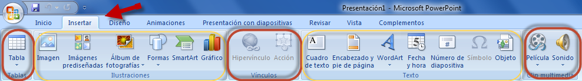
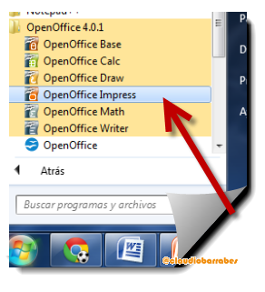
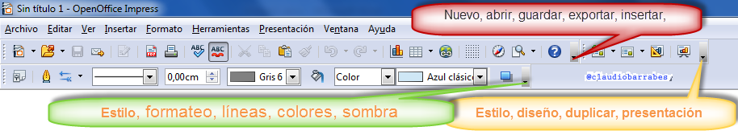
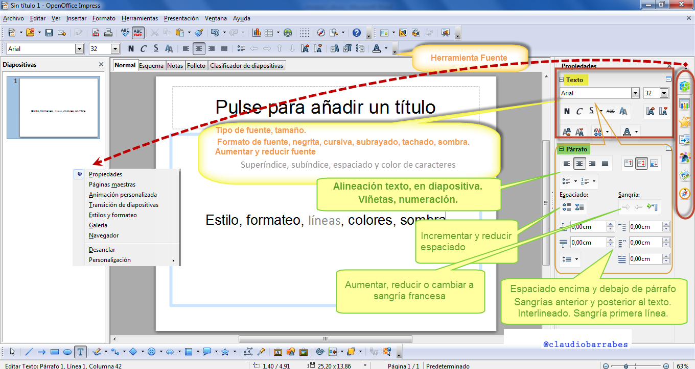
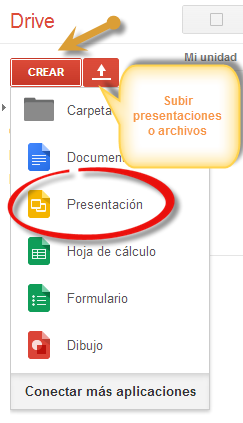

# U.4 La Cinta de Opciones.

### 3.1.  Herramientas en PowerPoint

( Fig.1.4.1: C.Barrabés, montaje pantalla captura programa, [Algunos derechos reservados](http://creativecommons.org/licenses/by-nc-sa/2.0/deed.es "Derechos reservados. Atribución-NoComercial-CompartirIgual 2.0 Genérica (CC BY-NC-SA 2.0)"))

  
Las herramientas están organizadas de forma lógica en fichas:

**Inicio, Insertar, Diseño, Animaciones, Presentación con diapositivas, Revisar, Vista, Formato**  y en mi caso complementos (ya que tengo un programa instalado que se complementa con este programa) y como se observa en el gráfico a su vez están divididas en grupos, que hemos enmarcado en naranja y rojo (Portapapeles, diapositivas, fuente, párrafo, dibujo y edición). Pero además como marcamos en **verde** hay más opciones ocultas en las pestañitas verdes, aunque, no las hemos marcado todas y os retamos a descubrirlas. Mirar un pequeño botón en su esquina inferior derecha.  Este botón abre un panel o cuadro de diálogo con más opciones relacionadas con el grupo en cuestión.

Por ejemplo, en la imagen vemos la pestaña más utilizada, Inicio, que contiene los grupos Portapapeles, Diapositivas, Fuente, Párrafo, Dibujo y Edición.

Para situarnos en una ficha diferente, simplemente hacer clic en su correspondiente nombre de pestaña.

Veamos la Barra Insertar:

( Fig.1.4.2: C.Barrabés, montaje pantalla captura programa, [Algunos derechos reservados](http://creativecommons.org/licenses/by-nc-sa/2.0/deed.es "Derechos reservados. Atribución-NoComercial-CompartirIgual 2.0 Genérica (CC BY-NC-SA 2.0)"))

Más tarde haremos la Practica  y o retamos a descubrir las barras de Diseño Animaciones, Revisar, vista etc.

**3.2.  Herramientas en  Open Office Impress**

Abramos el programa:  
  

( Fig.1.4.3: C.Barrabés, montaje pantalla captura programa, [Algunos derechos reservados](http://creativecommons.org/licenses/by-nc-sa/2.0/deed.es "Derechos reservados. Atribución-NoComercial-CompartirIgual 2.0 Genérica (CC BY-NC-SA 2.0)"))

**Iniciar** --\> **Todos los programas** --> **Open Office**. Nos aparece algo así:

(Fig.1.4.4: C.Barrabés, montaje pantalla captura programa, [Algunos derechos reservados](http://creativecommons.org/licenses/by-nc-sa/2.0/deed.es "Derechos reservados. Atribución-NoComercial-CompartirIgual 2.0 Genérica (CC BY-NC-SA 2.0)"))

Ahora fijémonos si queremos insertar texto en la diapositiva que pasa con la barra.

(Fig.1.4.5: C.Barrabés, montaje pantalla captura programa, [Algunos derechos reservados](http://creativecommons.org/licenses/by-nc-sa/2.0/deed.es "Derechos reservados. Atribución-NoComercial-CompartirIgual 2.0 Genérica (CC BY-NC-SA 2.0)"))

Ahora ya conocemos un poco más Impress

### 3.3.  Herramientas en  DRIVE

Entramos en nuestra cuenta Google (Ver Módulo 0 Unidad 3) :

( Fig.1.4.6: C.Barrabés, montaje pantalla captura programa, [Algunos derechos reservados](http://creativecommons.org/licenses/by-nc-sa/2.0/deed.es "Derechos reservados. Atribución-NoComercial-CompartirIgual 2.0 Genérica (CC BY-NC-SA 2.0)"))

Clickamos en el icono del triángulo tricolor (verde, amarillo y azul)

La primera vez que entramos, nos aparece este mensaje:

*   Google Drive te permite acceder a tus cosas en cualquier ordenador o dispositivo móvil.
*   Para añadir archivos, descarga Google Drive en tu PC o usa el botón rojo para subir.

Si lo deseamos también lo posemos descargar en nuestra máquina, para tener un enlace con mi unidad Drive.

Una vez abierto, podremos crear nuestras presentaciones o bien subirlas.

( Fig.1.4.7: C.Barrabés, montaje pantalla captura programa, [Algunos derechos reservados](http://creativecommons.org/licenses/by-nc-sa/2.0/deed.es "Derechos reservados. Atribución-NoComercial-CompartirIgual 2.0 Genérica (CC BY-NC-SA 2.0)"))

**3.4.  Herramientas en Keynote**

Ver video

[https://youtu.be/wwXhPU9xhio](https://youtu.be/wwXhPU9xhio)

