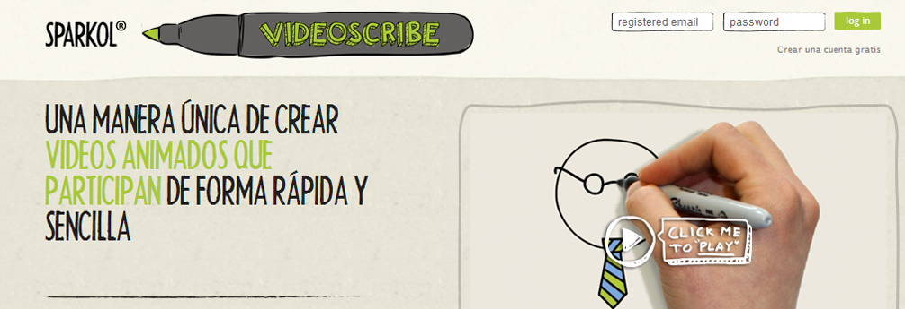

# U5. VideoScribe

Fig.6.5.1 Captura y recorte de la web [http://www.sparkol.com/](http://www.sparkol.com/)

**¿Qués es VideoScribe?**

Es una herramienta que permite realizar presentaciones exportables en formato de video y con agradables efectos visuales siendo el más destacado de ellos el que el texto es escrito por una mano y las imágenes dibujadas de igual forma, creando la sensación de estar frente a una pizarra o libreta.

El funcionamiento de la herramienta es muy sencillo, permitiendo acciones similares a las que se puede realizar en cualquier programa para crear presentaciones y el resultado se puede exportar como video.

Prezi ya no es ninguna novedad. Así que, si queremos seguir sorprendiendo a nuestra audiencia, no debemos cesar en la búsqueda de nuevas soluciones para presentar de un modo distinto.

**Para Educadores**

Para el  profesorado y a través de e-learning, el poder de VideoScribe nos da la capacidad para **explicar conceptos**, **ilustrar** conversaciones y cautivar al público de una manera nueva e increíble. No sólo se puede crear materiales de formación más rápido y más fácil.

Hay descuentos para el profesorado.

Ver Vídeo: [http://www.youtube.com/watch?v=VA3edOHGbWY](http://www.youtube.com/watch?v=VA3edOHGbWY)

**Tutoriales**

[http://www.youtube.com/playlist?list=PL941uNyvzPSFVX7Turb-DCTikB4FwLL55](http://www.youtube.com/playlist?list=PL941uNyvzPSFVX7Turb-DCTikB4FwLL55)

Actualizaremos información en el blog:

[http://claudiobarrabes.blogspot.com.es/2013/11/videoscribe.html](http://claudiobarrabes.blogspot.com.es/2013/11/videoscribe.html)

[http://youtu.be/V2YU7xWmtSo](http://youtu.be/V2YU7xWmtSo)

Otro Vídeo

[http://youtu.be/lk-mTOqQvMA](http://youtu.be/lk-mTOqQvMA)

http://youtu.be/zDZFcDGpL4U?t=31s

