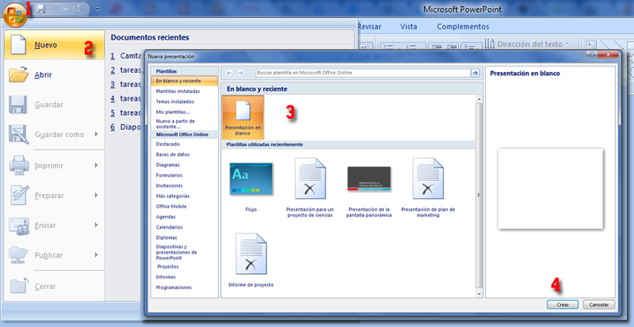
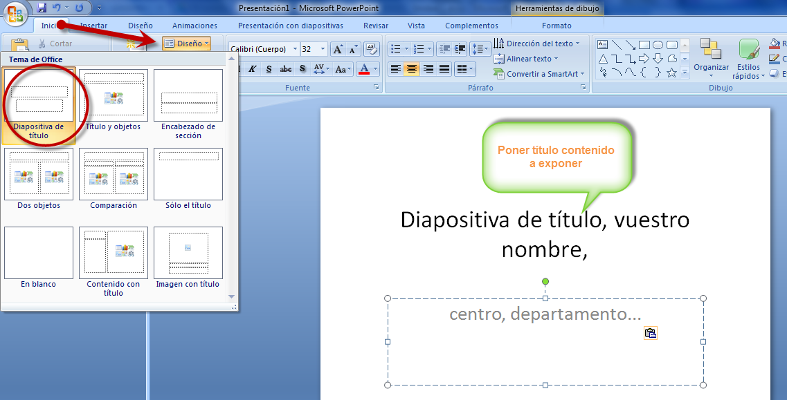
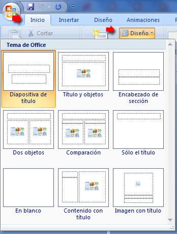
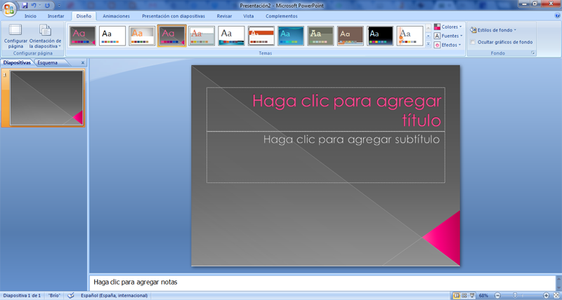
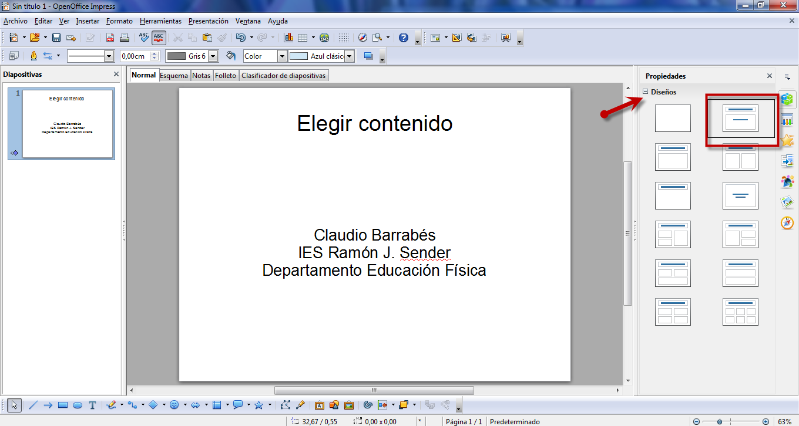
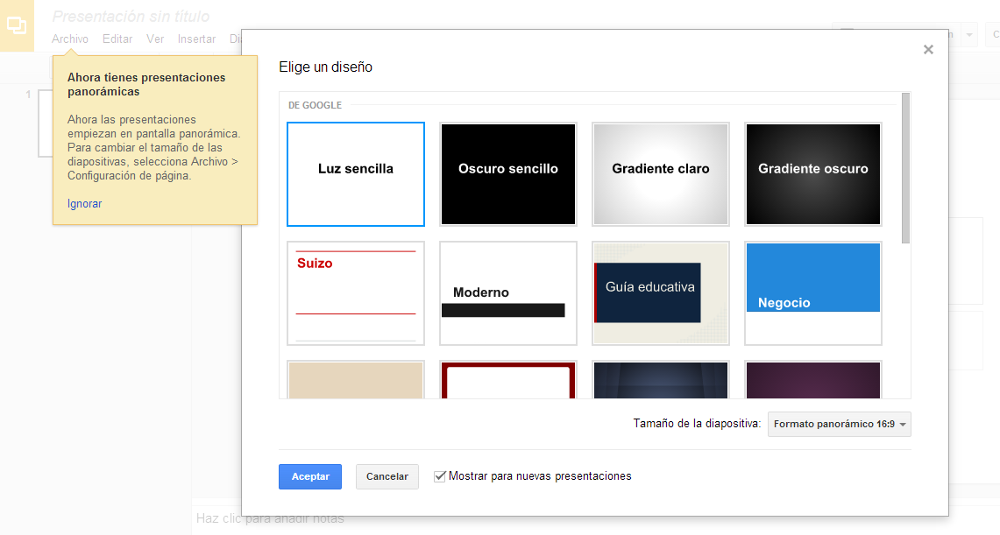
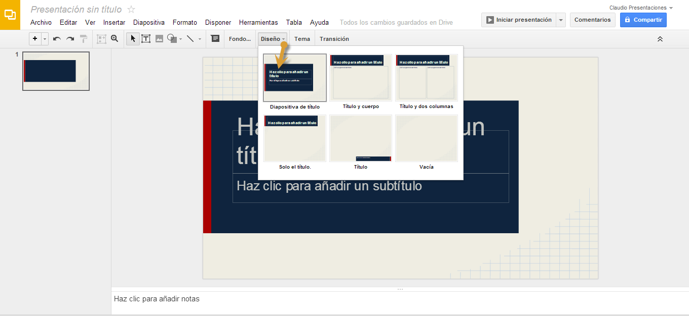
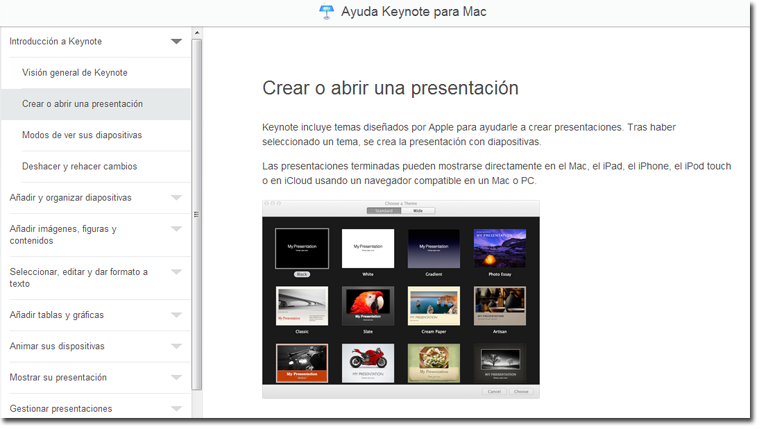

# U.5. Crear una presentación

Guiaremos los pasos, para completar la tarea de crear una presentación completa, con textos, colores, orientaciones, fuentes, imágenes y objetos. (Es la práctica obligatoria de este largo módulo) No os preocupéis, vamos a intentar hacerlo de forma **sencilla**, sin florituras, sin animaciones, para profundizar más en los siguientes Módulos.

A medida que vayamos siguiendo estos apuntes, podremos ir haciendo nuestra presentación para cumplir la tarea que enviaremos al tutor a través de **Drive, correo electrónico, compartiendo un enlace** (por ejemplo)

## 5.1.  Diapositiva de título, vuestro nombre, centro, departamento...

#### 5.1.1.  En PowerPoint

**¡Empezamos Por fin!**

**Abrir una presentación nueva**

Entramos en el botón de Office y señalamos Nueva-Presentación en blanco

Es interesante que sepamos algunos aspectos del diálogo que aparece:

*   En blanco es una presentación sin ninguna plantilla ni estilo predeterminados
*   Plantillas instaladas, Temas instalados, etc.. es para utilizar los estilos instalados, OnLine, ... elementos que utilizaremos en las próximas secciones

[Abrir una presentación de PowerPoint **2010** en PowerPoint 2003 o en una versión anterior](http://office.microsoft.com/es-es/powerpoint-help/abrir-una-presentacion-de-powerpoint-2010-en-powerpoint-2003-o-en-una-version-anterior-HA010338391.aspx)

Diseño en Power Point 2010 [http://office.microsoft.com/es-es/powerpoint-help/que-es-un-diseno-de-diapositiva-HA010338412.aspx](http://office.microsoft.com/es-es/powerpoint-help/que-es-un-diseno-de-diapositiva-HA010338412.aspx)

Diseño de la diapositiva

**Definir un diseño a la diapositiva existente**

Es muy fácil, en el botón **Diseño **de la barra estándar correspondiente al menú **Inicio **elegir una de las opciones que se nos presentan.

Consejo: Los diseños más comunes son los siguientes:

*   **Sólo título:** Recomendable para la primera diapositiva
*   **Título y subtítulo **es recomendable para el resto, luego se incorporan en esta diapositiva los diferentes elementos: cuadros de texto, imágenes....
*   **Título y objetos** recomendable para cuando queremos exponer elementos sin perder el esquema
*   **En blanco** Recomendable cuando no seguimos ningún esquema en la diapositiva.

Después siempre le podremos cambiar el tema:

En una presentación en blanco, cada diapositiva que creemos está totalmente vacía, sin elementos de diseño, el fondo blanco y la fuente la que tenga por defecto. 

Podemos sustituir este **diseño** cambiando el tema (en PowerPoint 2003 se llama _estilo, en PowerPoint 2007 temas)_ abriendo el **Panel de temas.**

**En PowerPoint 2010** 

*   Seleccionar la opción "Diseño de la diapositiva" en el menú Formato.
*   Usando la vista normal, clic en la pestaña Diapositivas y elegir las diapositivas a las que deseemos aplicar un diseño
*   Clic en el diseño que desees de las opciones que aparecen en el panel de tareas Diseño

Hay que tener en cuenta que el cambio de estilo o tema se aplica a todas las diapositivas

Tenemos varias maneras de abrir el panel de temas:

A la hora de crear una presentación en el botón de Office- Nuevo -**Temas instalados y elegimos el tema**

#### 5.1.2.  En OpenOffice

Elegimos para empezar :

a)      Tipo --> Presentación vacía. Siguiente

b)      Fondo --> Pantalla.

c)      Transición de diapositiva --> Efecto barrido hacia… --> Elegimos velocidad Rápida

d)      Crear

#### 5.1.3.  En Drive

Fijaros que nos deja elegir diseño, si queremos avanzar trabajo lo podemos hacer. Una de las novedades es que nos permite hacer presentaciones panorámicas. Debemos pensar en que resolución proyectaremos (este contenido lo veremos en otro módulo más adelante).

De momento bien ¿no? La verdad es que se parecen mucho verdad.

#### 5.1.4.  En Keynote

Os dejamos un tutorial, mirar el enlace, Crear o abrir una presentación:  [http://help.apple.com/keynote/mac/6.0/#/tan72232b56](http://help.apple.com/keynote/mac/6.0/#/tan72232b56)

