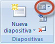
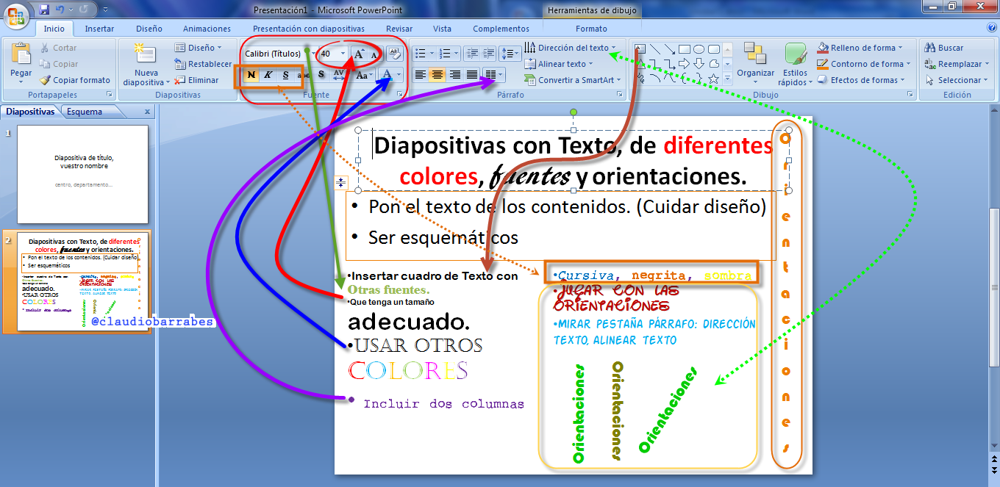
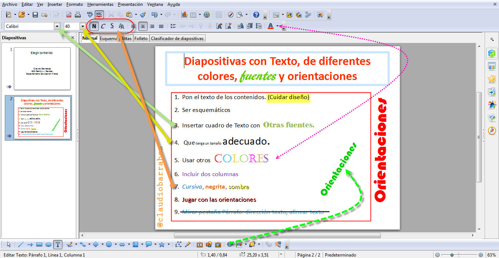
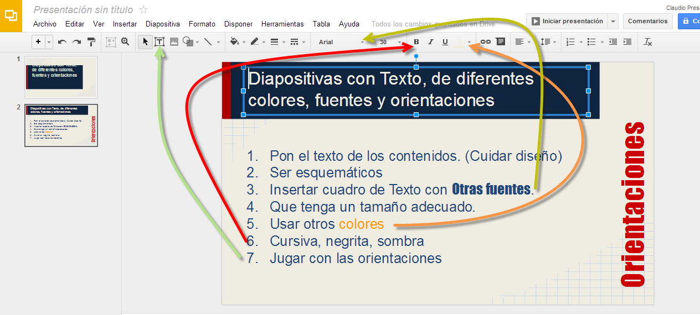
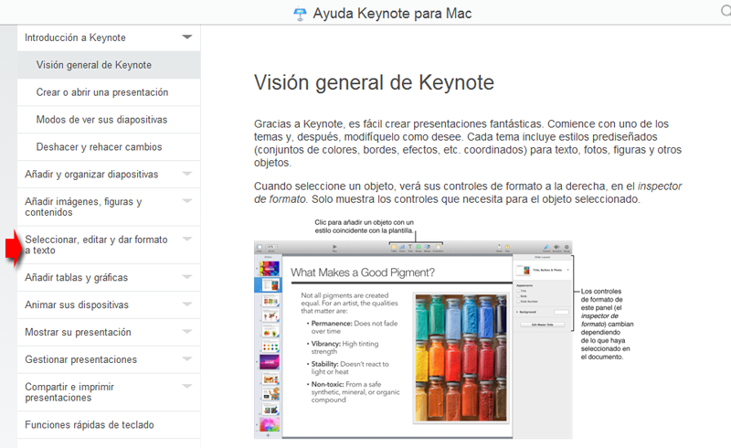

# U.6. Texto.

**2.1.  Diapositivas con Texto, de diferentes colores, fuentes y orientaciones.**

### 2.1.1.    PowerPoint

Nueva diapositiva--> Inicio -->ventana Diapositivas  : Título y objetos

 (Fig.2.2.1: C.Barrabés, montaje pantalla captura programa, [Algunos derechos reservados](http://creativecommons.org/licenses/by-nc-sa/2.0/deed.es "Derechos reservados. Atribución-NoComercial-CompartirIgual 2.0 Genérica (CC BY-NC-SA 2.0)"))

(Fig.2.2.2: C.Barrabés, montaje pantalla captura programa, [Algunos derechos reservados](http://creativecommons.org/licenses/by-nc-sa/2.0/deed.es "Derechos reservados. Atribución-NoComercial-CompartirIgual 2.0 Genérica (CC BY-NC-SA 2.0)"))

Este diseño, es simplemente para ilustrar los botones que deberemos usar. Recordemos las pautas del Módulo 0 para crear una buena presentación.

#### 5.1.2.     En OpenOffice

Veamos como mejoramos el diseño con un poco de orden:

(Fig.2.2.3: C.Barrabés, montaje pantalla captura programa, [Algunos derechos reservados](http://creativecommons.org/licenses/by-nc-sa/2.0/deed.es "Derechos reservados. Atribución-NoComercial-CompartirIgual 2.0 Genérica (CC BY-NC-SA 2.0)"))

#### 5.1.3.     En Drive

A medida que vamos haciendo presentaciones mejoramos en el diseño, ánimo adelante y probar todas las opciones que veáis.

(Fig.2.2.4: C.Barrabés, montaje pantalla captura programa, [Algunos derechos reservados](http://creativecommons.org/licenses/by-nc-sa/2.0/deed.es "Derechos reservados. Atribución-NoComercial-CompartirIgual 2.0 Genérica (CC BY-NC-SA 2.0)"))

#### 5.1.4.     En Keynote

Seleccionar, editar y dar formato a texto

[Ver enlace](http://help.apple.com/keynote/mac/6.0/#/tan79a8f6388)

[http://help.apple.com/keynote/mac/6.0/#/tan79a8f6388](http://help.apple.com/keynote/mac/6.0/#/tan79a8f6388)

(Fig.2.2.5: Appel, montaje pantalla captura programa, [http://help.apple.com/keynote/mac/6.0/#/tan79a8f6388](http://help.apple.com/keynote/mac/6.0/#/tan79a8f6388))

Aprendamos un poco más siguiendo el enlace de la imagen

(Fig.2.2.6: C.Barrabés, montaje pantalla captura web, [Algunos derechos reservados](http://creativecommons.org/licenses/by-nc-sa/2.0/deed.es "Derechos reservados. Atribución-NoComercial-CompartirIgual 2.0 Genérica (CC BY-NC-SA 2.0)"))

