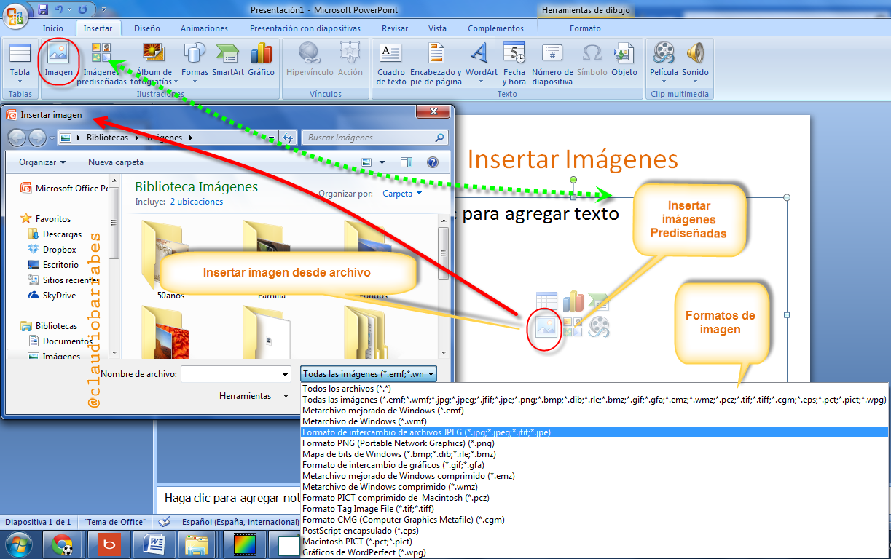
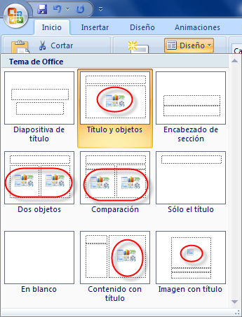
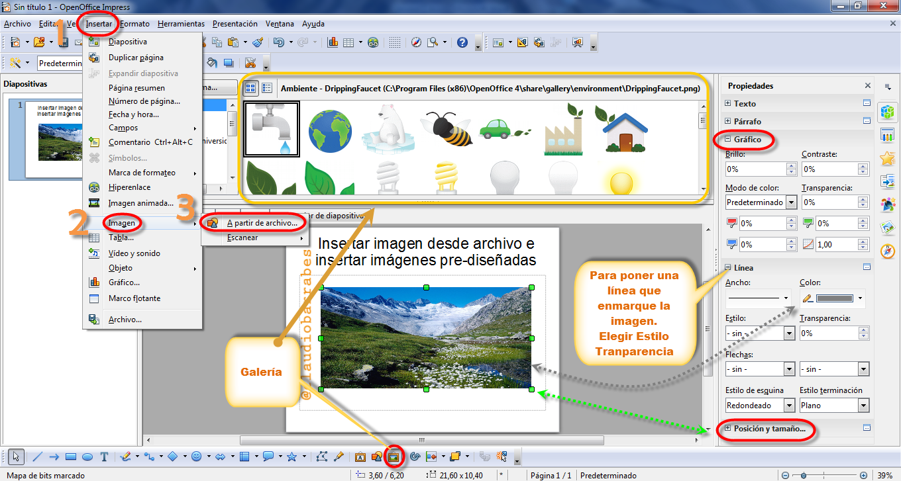
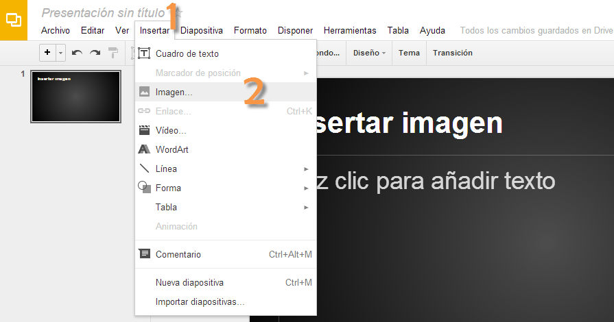
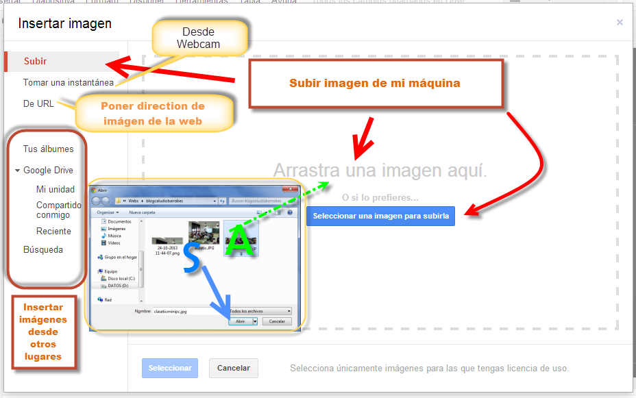
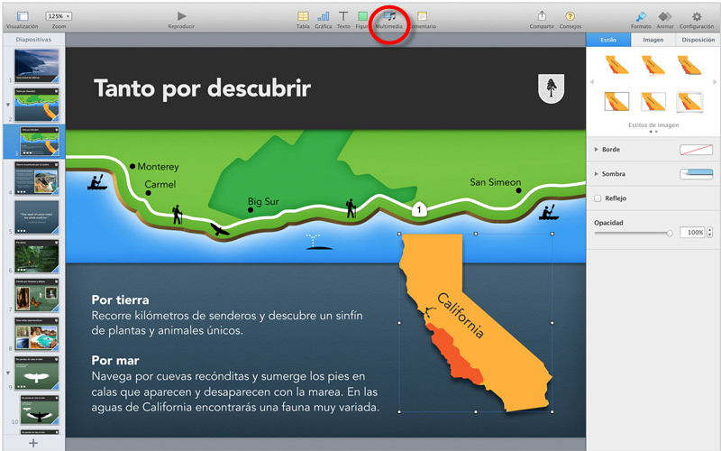

# U.7 Diapositiva con Imágenes

**3.1.  Diapositiva con  Imágenes**

Podemos insertar imágenes desde:

*   **Archivo** (Desde nuestro ordenador) Más adelante aprenderemos a capturarlas desde imprimir pantalla, recortes, un escáner, cámara, teléfono móvil…
*   **Prediseñadas** (De la galería de imágenes de los programas. En una librería organizada por categorías.)
*   **Desde Internet**  (Buscando en la red. Cuidado con el copyright © de estas imágenes, si no dicen nada las imágenes tienes derechos de autor y se debe pedir permiso al dueño.  Si se decide utilizarlas, sin ánimo de lucro, lo que podemos hacer es nombrar la fuente.

Los formatos de Imagen,  normalmente fotografías procedentes de cámaras digitales, capturas desde cualquier dispositivo.  Suelen ser de tipo JPG. Existen otros formatos interesantes, png, pdf, tiff etc. Dependiendo del programa que utilicemos, podremos guardar en uno u otro formato.

En éste curso aprenderemos a manejar varios, pero nos coordinaremos con el curso de retoque de imagen y en el módulo de imagen aprenderemos cuatro pasos sencillos para lo básico de estas.

**3.1.1.     PowerPoint**

#### Insertar imagen desde archivo e insertar imágenes prediseñadas

(Fig.2.3.2: C.Barrabés, montaje pantalla captura programa, [Algunos derechos reservados](http://creativecommons.org/licenses/by-nc-sa/2.0/deed.es "Derechos reservados. Atribución-NoComercial-CompartirIgual 2.0 Genérica (CC BY-NC-SA 2.0)"))

Lo podemos hacer de varias formas. Desde la pestaña **Inicio **--> **Ilustraciones** o directamente desde el centro de la diapositiva con un diseño:

(Fig.2.3.3: C.Barrabés, montaje pantalla captura programa, [Algunos derechos reservados](http://creativecommons.org/licenses/by-nc-sa/2.0/deed.es "Derechos reservados. Atribución-NoComercial-CompartirIgual 2.0 Genérica (CC BY-NC-SA 2.0)"))

Podéis repasar esto [aquí](http://aularagon.catedu.es/materialesaularagon2013/presentaciones/PowerPoint2007/12_desde_archivo.html).

**3.1.2.     En OpenOffice**

(Fig.2.3.4: C.Barrabés, montaje pantalla captura programa, [Algunos derechos reservados](http://creativecommons.org/licenses/by-nc-sa/2.0/deed.es "Derechos reservados. Atribución-NoComercial-CompartirIgual 2.0 Genérica (CC BY-NC-SA 2.0)"))

1\. Insertar 2.a mitad del desplegable aparece imagen. Fijémonos que podemos insertar desde aquí otros elementos: Tabla, Vídeo y sonido, objeto. Lo veremos más adelante. Lo más fácil es a partir de un archivo que tengamos, si es de la galería no pesará mucho, si es de una cámara o lo escaneamos, deberemos tratar la imagen para bajarle el peso y que nuestra presentación no sea muy pesada. Antiguamente esto era un problema mayor al tener que mandar una presentación por correo, el peso era muy grande y no la podíamos mandar o nos daba muchos problemas de tiempo de carga. Esto lo veremos en otro módulo.

Mirar la barra de herramientas inferior de la figura 2.3.2 que tiene un icono que nos lleva a la galería. La foto o imagen insertada, la podemos redimensionar, manejando los cuadraditos verdes como los que aparecen en pantalla. Lo mismo desde posición y tamaño en rojo de la parte inferior derecha figura 2.3.2.

También podemos ponerle una línea alrededor de la imagen, cambiarle ese color gris y elegir un grosos a gusto y respetando las normas de diseño Módulo 0

**3.1.3.     En Drive**

****

(Fig.2.3.5: C.Barrabés, montaje pantalla captura programa,  [Algunos derechos reservados](http://creativecommons.org/licenses/by-nc-sa/2.0/deed.es "Derechos reservados. Atribución-NoComercial-CompartirIgual 2.0 Genérica (CC BY-NC-SA 2.0)"))

****

(Fig.2.3.6: C.Barrabés, montaje pantalla captura programa, [Algunos derechos reservados](http://creativecommons.org/licenses/by-nc-sa/2.0/deed.es "Derechos reservados. Atribución-NoComercial-CompartirIgual 2.0 Genérica (CC BY-NC-SA 2.0)"))

En Drive parece que todo es más sencillo, al existir menos botones a elegir. Fijémonos en que, al igual que en algunos blog podemos arrastrar la imagen desde una carpeta abierta, como indica la **A** verde. Podemos insertar la imagen en le nube Drive, abriendo la imagen como lo haríamos habitualmente. También podemos incluir una imagen desde le URL (Un **localizador de recursos uniforme**, más comúnmente denominado **URL** (sigla en inglés de _uniform resource locator_), es una secuencia de caracteres, de acuerdo a un formato modélico y estándar, que se usa para nombrar recursos en [Internet](http://es.wikipedia.org/wiki/Internet "Internet") para su localización o identificación, como por ejemplo documentos textuales, imágenes, vídeos, presentaciones digitales, etc.)

Y por otro lado, si tenemos Álbumes, imágenes en la Unidad Dirver o alguien lo ha compartido conmigo, podré insertar esas imágenes en la presentación. (Recordar siempre debo saber si puedo usar esas imágenes. Nuestro consejo, al ser una presentación educativa y sin ánimo de lucro es hacer referencia al autor. 

## Actividad de lectura

Leer el artículo. [http://claudiobarrabes.blogspot.com.es/2013/10/citar-una-imagen-fotografia.html](http://claudiobarrabes.blogspot.com.es/2013/10/citar-una-imagen-fotografia.html)

 Colaboradores de Wikipedia, "Localizador uniforme de recursos," Wikipedia, La enciclopedia libre, [http://es.wikipedia.org/w/index.php?title=Localizador\_uniforme\_de_recursos&oldid=70127867](http://es.wikipedia.org/w/index.php?title=Localizador_uniforme_de_recursos&oldid=70127867) (descargado 26 de octubre de 2013).

Comentar en el foro lo que desconocíais y si lo que aplicareis  a partir de ahora.

var feedback104\_118\_6text = "Mostrar retroalimentación";

### Retroalimentación

Si tenéis alguna sugerencia dejar un comentario en el Blog. Gracias de antemano.

**3.1.4.     En Keynote**

*   Abrir "**Aplicaciones**\> **iWork**\> **Keynote**". Abrir un archivo.
*   Importa un archivo de imagen o icono **directamente** en Keynote abriendo la carpeta en el buscador, buscando el archivo de imagen. Arrastrar el archivo a la pantalla abierta de Keynote. Aparece  un más de color verde sobre la pantalla. Soltar el archivo y la imagen aparecerá en la pantalla.
*   Importa **arrastrándola** **desde otra aplicación** abierta y colocándolo en la pantalla.
*   **Copiar y pegar** desde otro programa. Seleccionar la imagen, marcándola y presionando (**Ctrl + C)** o "Copiar" en el menú de edición. En un explorador Web, hacer control-clic en la imagen y selecciona "Copiar imagen". Pegar la imagen en Keynote pulsando (**Control + V)** o seleccionando la opción "Pegar" en el menú de edición. 

(Fig.2.3.7: C.Barrabés, montaje pantalla captura programa, [Algunos derechos reservados](http://creativecommons.org/licenses/by-nc-sa/2.0/deed.es "Derechos reservados. Atribución-NoComercial-CompartirIgual 2.0 Genérica (CC BY-NC-SA 2.0)"))

#### Como importar una imagen

Podemos importar una imagen directamente desde el Finder o desde el visualizador multimedia.

Para importar un archivo de imagen:

Arrastrar un archivo de imagen desde el fin de hasta el documento y colocarlo donde deseemos.

Arrastrar una imagen al navegador desde diapositivas para crear una nueva diapositiva que contenga dicha imagen.

Hacer clic en multimedia en la barra de herramientas, hacer clic en fotos en la visualización multimedia, seleccionar el álbum donde se encuentra imagen y a continuación arrastrar una miniatura para colocarla donde deseemos.

Seleccionada insertar > seleccionan, elegimos que el archivo,. Arrastrar la imagen para colocarla donde deseemos.

### Truco

Por omisión, si tamaño una imagen colocada en una diapositiva es mayor que la propia diapositiva, Keynote su muestre a la imagen para que se ajusten a la diapositiva. (una imagen cuya resolución se ha reducido presenta menos pixels que la imagen original; se elimina parte de la información de la imagen.) Las imágenes en formatoJPEG siguen siendo imágenes JPEG; otros formatos se convierten a TIFF.

Una vez se haya reducido la imagen para ajustarla la diapositiva, no podrán restaurar la su tamaño original haciendo clic en “tamaño original” en el inspector de las dimensiones. Para evitar el uso de imágenes o muestre arrastrar y utilizarlas con su tamaño original, seleccionas Keynote>Preferencias hacemos clic en General y anula vamos la selección de la acción “ reducir las imágenes hasta ajustarlas a las diapositivas”

