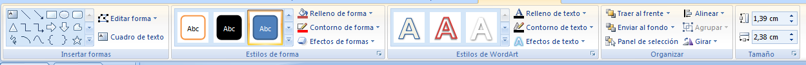

# U.8. Insertar Objetos

**Muy Importante:**

Cuando creemos un proyecto, debemos CREAR UNA CARPETA NUEVA y **ponerlo todo dentro de ella.**

Si luego queremos comprimir y mandar a alguien no nos faltará algún archivo (desperdigado en nuestro disco duro), y nos podría dar problemas en la presentación.

**8.1. PowerPoint**

****

Hemos insertado Formas. Si desplegamos la pestaña de formas nos aparecen un montón de símbolos que podremos utilizar para nuestras presentaciones, sólo debemos elegir la forma deseada, ir a la diapositiva, nos aparece un símbolo +, apretamos botón izquierdo y ya la tenemos.

Para modificar esa forma sólo tendremos que seleccionarla haciendo un clic sobre ella y elegir los parámetros deseados. Veamos la barra que aparece para insertar de nuevas, cambiar el estilo, darle un estilo WordArt, organizar (por si se nos monta una imagen sobre otras ordenarlas) y cambiar tamaño, aunque cuando aparecen las bolas o cuadrados blancos a la  forma,  la podemos engrandar o achicar como deseemos, recordar que la bolita verde nos permite rotar imagen.

Repasando el gráfico, fijémonos que desde insertar, nos hemos centrado en las **formas**, el **smartart** son unos gráficos muy útiles que podremos modificar fácilmente el texto o diseño, al insertarlos nos aparece una cuadro lateral que nos permite cambiar textos, lo mismo con el **gráfico**, nos aparecerá una Excel que a medida que cambiemos los datos en el cambiará la gráfica.

El **hipervínculo** es para poner enlaces 8 nosotros hemos puesto un enlace a una cuenta de correo poniendo  [**mailto**:cbarrabes@iesender.org](mailto:cbarrabes@iesender.org "Mail Autor")

**Acción:** configuraremos sobre una, forma, cuadro de texto… poniendo un **_hipervínculo_** a otra diapositiva de la presentación (podemos ir donde queramos de la misma, de esta forma conseguimos que la presentación, no sea lineal ), podemos poner enlaces a URL, Webs o a otros archivos que queramos abrir (recordar que cuando hagamos esto, es interesante preparar la presentación y tenerlo todo colocado en una misma carpeta, para que no  perdamos archivos necesarios al hacer la presentación), también lo podemos vincular a otra presentación, generando de esta forma un árbol de presentaciones. También podremos **_ejecutar otro programa_**, un **_marco_**, **_darle acción a un objeto_**, que reproduzca un **_sonido_** al hacer clic sobre el objeto que estamos configurando la acción o resaltar al hacer clic.

**8.2.     En OpenOffice**

Vamos a insertar varias cosas en nuestra presentación:

Seleccionamos el tipo de **hipervínculo** que se debemos insertar. (Repetimos y lo hacernos en la palabra correo y para mandar una enlace a una cuenta como antes)

**A Internet**

Utilicemos la página Internet del diálogo Hiperenlace para editar hiperenlaces con direcciones WWW o FTP.

**Correo y noticias**

En la página Correo y noticias del diálogo Hiperenlace se pueden editar los hiperenlaces de las direcciones de correo-e y noticias.

**Documento**

Para editar los hiperenlaces a cualquier documento o destinos dentro de los documentos se pueden editar desde la pestaña Documento del diálogo Hiperenlace.

**Nuevo documento**

Utilicemos la pestaña Nuevo documento del diálogo Hipervínculo para configurar un hiperenlace a un documento nuevo y crear dicho documento de forma simultánea.

**4.3.     En Drive**

Ver enlace : Cómo insertar y disponer texto, figuras y líneas. [https://support.google.com/drive/answer/1696521?hl=es&ref_topic=1694924](https://support.google.com/drive/answer/1696521?hl=es&ref_topic=1694924)

**8.4.     En Keynote**

Ver enlace: [http://help.apple.com/keynote/mac/6.0/#/tan72232820](http://help.apple.com/keynote/mac/6.0/#/tan72232820)

** Añadir una figura**

1.  Clic en Figura   en la barra de herramientas.

Para ver más estilos de figura, clic en las flechas.

2\. Seleccionar una figura para añadirla a la diapositiva.

### Añadir texto dentro de una figura

*   Doble clic en la figura para hacer aparecer el punto de inserción y escribir el texto.

Si hay demasiado texto que mostrar en la figura, aparecerá un indicador de recorte (+). Para cambiar de tamaño una figura, clic en ella y, a continuación, arrastrar cualquier tirador de selección hasta que aparezca todo el texto.

Podemos formatear el texto que hay dentro de la figura, al igual que cualquier otro texto en la diapositiva. Seleccionar el texto y, a continuación, utilizar las herramientas del panel Texto del inspector de formato para modificarlo.

