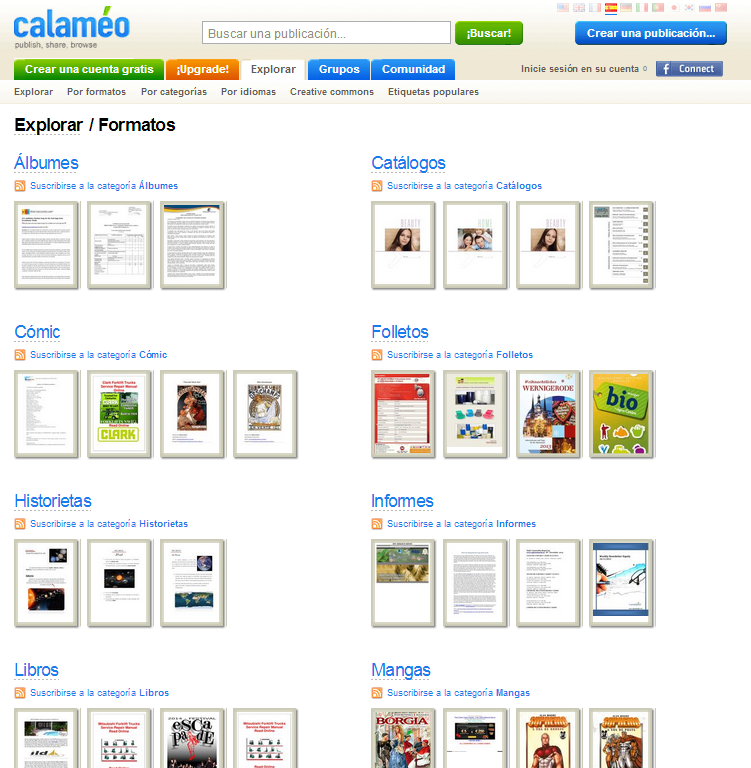

# U9. Calaméo

### ¿Qué es Calaméo?

**Calaméo** una **plataforma** para publicar, buscar y compartir documentos en línea. Se pueden organizar las publicaciones en subscripciones. También se pueden añadir comentarios e iniciar discusiones sobre cada publicación.

**Nos lo venden como: **

*   ### Publicar
    
    Cargar formatos más importantes y convertirlos en publicaciones digitales. **GRATIS e ilimitado.**
*   ### Compartir
    
    Publicaciones con una audiencia mundial y podemos incluirlas en nuestra Web o blog.
*   ### Explorar
    
    En la biblioteca, podemos encontrar lecturas interesantes entre millones de publicaciones.
*   **Cuentas**
    *   **Premium: Todas las características básicas**
        *   Gestión de suscriptores con potente sistema de administración de derechos digitales (DRM)
        *   Personalización avanzada de diseño con CSML
        *   Acceso directo API
    *   **Platinum: Todas las características Premium**
        *   Visualizador sin marca (ya no más marca Calaméo)
        *   Descarga directa

Ejemplo del CRA Arco Iris (Prov. Huesca)

[http://www.calameo.com/read/0000488584bbe466188af](http://www.calameo.com/read/0000488584bbe466188af)
